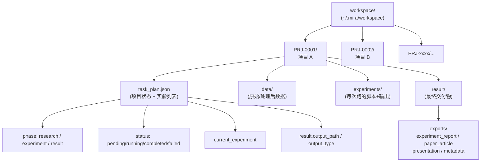

# 核心概念

读完本页，你应该能在脑里画出 `{{PROJECT_CORE_NAME}}` 的运行模型，并理解 UI / 日志中频繁出现的术语。所有概念都是“工程上必须存在的实体”，不是营销词。

## 一句话总结

> `{{PROJECT_CORE_NAME}}` = **一个跑在你本地的 Agent Runtime + 一组医学研究 Skills + 一个把所有产物都落到磁盘的工作区（workspace）**。
>
> `{{PROJECT_UI_NAME}}` = **可视化 + 操作面板**，它本身不存数据，所有真相都在 `~/.mira/` 里。

## 实体关系



## 1. Workspace（工作区）

**位置**：默认 `~/.mira/workspace`，可由 `agents.defaults.workspace` 覆盖。

- 这是 Agent **唯一允许写入** 的目录。所有读写工具（`write_file`、`exec`、`apply_patch` 等）都被沙箱守卫强制限定在它之内。
- Agent 仍可 **只读** 访问框架内置的 skills（`mira_engine/skills/...`），但不能写。
- 工作区内每个一级子目录通常对应一个项目（`PRJ-0001/` …）。

> 想换位置？修改 `~/.mira/config.json` 的 `agents.defaults.workspace`，再 `mira status` 验证生效即可。CLI 调用还可临时用 `--workspace /path/to/other/ws` 覆盖。

## 2. Project（项目）

**载体**：`workspace/PRJ-xxxx/` 目录。

一个项目对应一个研究主题，包含：

| 子项 | 路径 | 含义 |
| --- | --- | --- |
| `task_plan.json` | 项目根 | 项目级状态机；UI 显示的几乎所有信息都来自它。 |
| `data/` | 项目根 | 原始数据 + 预处理产物。 |
| `experiments/` | 项目根 | 每个实验的脚本、配置、日志、模型权重。 |
| `result/exports/` | 项目根 | Result 阶段导出的报告 / 论文 / PPT / metadata 包。 |

**生命周期**：`pending` → `running` → `completed` 或 `failed`。
**完成判定**：项目级 `completed` ≠ 实验都跑完，必须 `result.output_path` 存在且 `output_type` 合法。

## 3. Experiment（实验）

`task_plan.json` 中的 `experiments[]` 数组里每一项都是一个实验单元。每个实验有：

- `status`：`pending` / `running` / `completed` / `failed`
- `results.metrics`：指标表（如 AUC、Dice、HR、p 值）
- `results.findings`：文字结论
- `results.artifacts`：产出文件路径列表（图、CSV、模型）
- 严格模式（research strict）下还要求：
  - `theoretical_proof` — 理论或方法依据
  - `isolation_test` — 隔离对照
  - `post_mortem` — 失败/异常复盘
  - `evidence_refs` — 证据引用

不齐全的字段会被 [guardrail](./usage/ui/guardrail-and-auto-repair.md) 捕获并触发自动修复回合。

## 4. Task Plan（task_plan.json）

UI 上看到的任何状态、阶段、结果摘要，都可以在 `PRJ-xxxx/task_plan.json` 里找到原文。**真相在文件里，UI 是它的视图。**

关键字段：

```jsonc
{
  "id": "PRJ-0001",
  "title": "Dixon-MRI 呼气/吸气分类",
  "phase": "experiment",            // research / experiment / result
  "status": "running",
  "current_experiment": "exp-003",
  "experiments": [
    {
      "id": "exp-001",
      "status": "completed",
      "results": {
        "metrics": { "auc": 0.91 },
        "findings": "3D ResNet 优于 2D",
        "artifacts": ["experiments/exp-001/best_model.pt"]
      }
    }
  ],
  "result": {
    "output_path": "result/exports/experiment_report.md",
    "output_type": "experiment_report",
    "summary": "..."
  }
}
```

## 5. Phase / Run Mode / Agent Profile / Contract Version

四个互相正交的“运行旋钮”，决定 Agent 一回合接一回合的行为：

| 旋钮 | 取值 | 直觉 |
| --- | --- | --- |
| **phase** | `research` / `experiment` / `result` | 当前在生命周期哪一段。决定 Agent 优先调度的 skill 集。 |
| **run_mode** | `manual` / `auto` | `manual` 每一步停下来等你确认；`auto` 自动连跑直到自然终止或 guardrail 拦截。 |
| **agent_profile** | `default` / `engineer` / `research` | 系统提示词 + 默认工具偏好。`research` 更挑剔证据链，`engineer` 偏代码。 |
| **contract_version** | `v1` / `v2` / `strict` | 输出结构约束等级；`strict` 缺字段就会被 guardrail 拦下。 |

经验组合：

- **探索期**：`manual` + `research` + `strict`，慢但稳。
- **稳定迭代**：`auto` + `engineer` + `v1`，快。
- **科研交付**：`auto` + `research` + `strict`，吞吐 + 完整证据。

## 6. Guardrail（结构守卫）

每次实验/导出落地后，Agent 会按 `contract_version` 把字段校验一遍。任何缺失/占位文本/无效证据都会触发一次专用的 **修复回合**，Agent 会自己回头补齐字段，而不是让你手工改 JSON。

UI 上看到“暂停推进新实验、出现缺失字段提示”，通常就是 guardrail 在工作。详见 [Guardrail 与自动修复](./usage/ui/guardrail-and-auto-repair.md)。

## 7. Session（会话）

CLI / UI / 任意 channel 调用 Agent 时都隐式带一个 `session` ID（默认 `cli:direct`）。同一 session 内的对话共享上下文与记忆。
跨设备共享单一会话可在 `agents.defaults.unifiedSession` 打开（适合“一个人多端”的场景）。

## 8. Provider / Model / Routing

- **Provider**：模型供应商（OpenAI、Anthropic、OpenRouter、DeepSeek、Ollama……）。`{{PROJECT_CORE_NAME}}` 内置 [20+ provider](./usage/agent-config/providers-and-runtime.md)。
- **Model**：具体型号（如 `anthropic/claude-opus-4-5`）。
- **Routing**：开启 `routeByComplexity` 后，`{{PROJECT_CORE_NAME}}` 会按任务复杂度路由到 `smallModel` / `mediumModel` / `largeModel`，便宜的活走便宜的模型。详见 [模型路由](./usage/agent-config/model-router.md)。

## 9. Skills（技能）

技能 = **一段写好的“做某件事”的标准操作流程 + 模板代码**。Agent 调用 skill 而不是直接写代码，可以保证可复现、可审计。内置技能分类（节选）：

| 分类 | 代表 skill |
| --- | --- |
| `medical-imaging/` | `medical-image-dl-pipeline`、`radiomics`、`pyradiomics`、`monai`、`pydicom`、`dicom2nifti` |
| `ml-statistics/` | `survival-analysis`、`statistical-analysis`、`scikit-learn`、`scikit-survival` |
| `research/` | `deep-research`、`pubmed-search`、`peer-review`、`scientific-method` |
| `visualization/` | `matplotlib`、`seaborn`、`scientific-slides`、`scientific-schematics` |
| `engineering/` | 通用代码任务 |
| `documents/` | 文档处理 |
| `cron/` | 周期任务 |
| `summarize/` | 摘要 |
| `skill-creator/` | 你可以用它做新 skill |

完整列表见 [Skills 与 Tools](./usage/agent-config/skills-and-tools.md)。

## 10. Tools（工具）

Skill 是“怎么做”，Tool 是“能做”。`{{PROJECT_CORE_NAME}}` 提供：

- `filesystem`：受沙箱保护的读/写/列文件。
- `shell`（`exec`）：受 `tools.exec` 配置约束的子进程执行（带 timeout、PATH 注入、可选 bwrap 沙箱）。
- `web`：DuckDuckGo / Brave / Tavily / SearXNG / Jina 等搜索 + 抓取。
- `mcp`：任意符合 Model Context Protocol 的外部 server，可在 `tools.mcpServers` 里挂载。

详见 [Skills 与 Tools](./usage/agent-config/skills-and-tools.md)。

---

## 你应该立即记住的几件事

1. **真相在磁盘**：UI 状态对不上时先打开 `task_plan.json`。
2. **沙箱很严**：Agent 写不了 workspace 之外的目录；如果要换位置，改 `agents.defaults.workspace`，别 hack 路径。
3. **`mira-engine` 是后台服务管理 CLI**，不是 Python 包名以外的东西；普通使用基本只用 `mira`。
4. **从 MedPilot 升级**：第一次启动会自动迁移，无须手工 `mv`。
