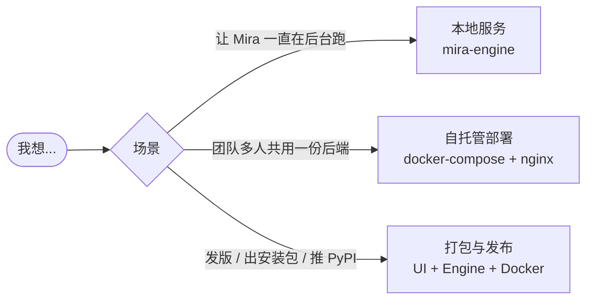

# 部署与发布

本节覆盖三类场景：

| 页面 | 适合 |
| --- | --- |
| [本地服务（mira-engine）](./local-engine-service.md) | 单机用户：希望关掉终端 Mira 仍在跑、Electron 自动连接 |
| [自托管部署](./self-hosted.md) | 团队 / 实验室：docker-compose + nginx，多人共用一份后端 |
| [打包与发布](./release-and-package.md) | 维护者：推 tag 出 wheel/dmg/exe/AppImage/PyPI/Docker 镜像 |
