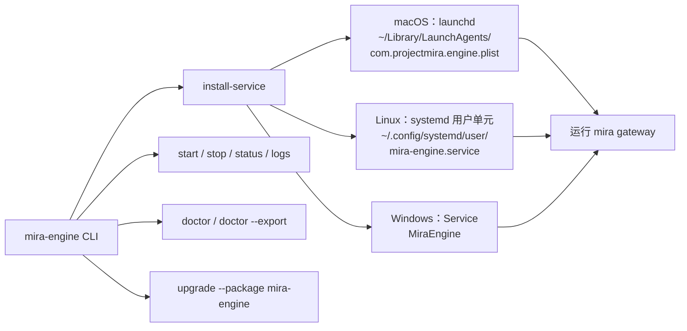
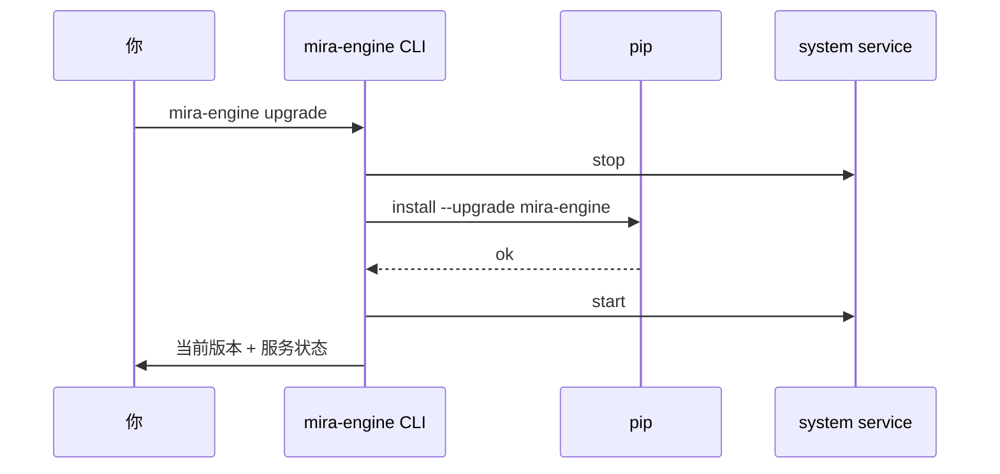

# 本地服务（mira-engine）

## 它解决什么

`mira gateway` 跑在前台终端关掉就停。**`mira-engine`** 把它包装成系统服务（macOS launchd / Linux systemd / Windows Service），让 Mira 像 Docker Desktop 一样开机即用，关掉终端不掉。

> 普通使用不需要它。当你希望关掉终端 Mira 仍在跑、或者想被 Electron UI 自动 spawn，再考虑装。

## 总览



## 一次安装

```bash
mira-engine install-service
```

它会按平台自动写入对应注册项，并立即启动一次。注册位置：

| 平台 | 路径 |
| --- | --- |
| macOS | `~/Library/LaunchAgents/com.projectmira.engine.plist` |
| Linux | `~/.config/systemd/user/mira-engine.service` |
| Windows | 服务名 `MiraEngine` |

> 都是 **用户级**，不需要 sudo。Linux 想要开机自启需要执行一次 `loginctl enable-linger $USER`。

## 日常命令

```bash
mira-engine status      # 当前是否运行 + PID + 端口
mira-engine start       # 启动
mira-engine stop        # 停止
mira-engine logs        # 跟踪最新日志
mira-engine logs -n 200 # 打印最近 200 行
```

## 升级

```bash
mira-engine upgrade                          # 升 PyPI 上的 mira-engine
mira-engine upgrade --package mira-engine    # 等价（显式指定包名）
```

升级流程：



升级失败时 CLI 会自动尝试重启回旧版本。

## 诊断

```bash
mira-engine doctor              # 屏幕打印诊断结果
mira-engine doctor --export     # 同时导出到 ~/.mira/runtime/diagnostics/<timestamp>.zip
```

`doctor` 会检查：

- Python 版本与依赖（`mira_engine` 包是否能 import）
- 端口占用（`MIRA_GATEWAY__PORT`）
- 配置文件可读性、必填字段
- workspace 读写权限
- Provider key 至少有一个可用（不会真的发请求验证）
- 系统服务注册项是否存在且健康

`--export` 出来的 zip 可以直接发给维护者排障，**不会** 包含 `apiKey` 字段（自动脱敏）。

## 卸载

```bash
mira-engine stop
mira-engine uninstall-service
pip uninstall mira-engine
```

可选清理：

```bash
rm -rf ~/.mira/logs ~/.mira/runtime
# 项目数据非常宝贵，确认后再删：
# rm -rf ~/.mira/workspace
```

## 与 Electron UI 的协作

Electron 启动时会按这个顺序找 engine：

1. `MIRA_ENGINE_PATH` 环境变量；
2. `PATH` 上的 `mira-engine`；
3. 安装包内置的 PyInstaller 二进制。

如果你已经 `mira-engine install-service` 把后台跑起来了，UI 会优先连 `localhost:18790`，不会重复 spawn。

## 验收检查

- [ ] 关掉所有终端后 `curl http://127.0.0.1:18790/api/health` 仍返回 200。
- [ ] 重启电脑后服务自动起来（macOS 自动；Linux 需要 `loginctl enable-linger`；Windows 默认自动）。
- [ ] `mira-engine doctor` 全绿。
- [ ] `mira-engine upgrade` 升级后版本号变化、服务保持运行。
