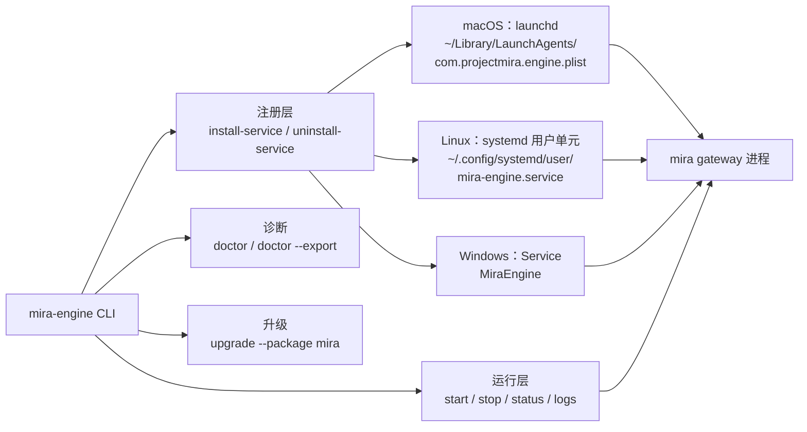
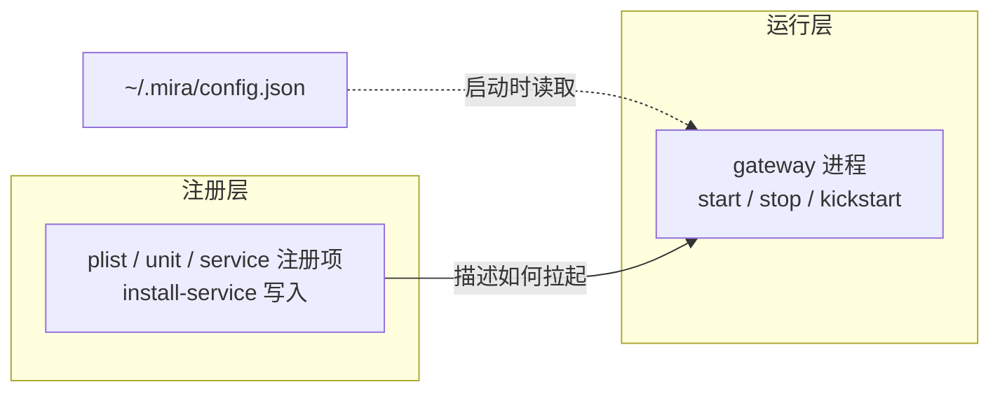
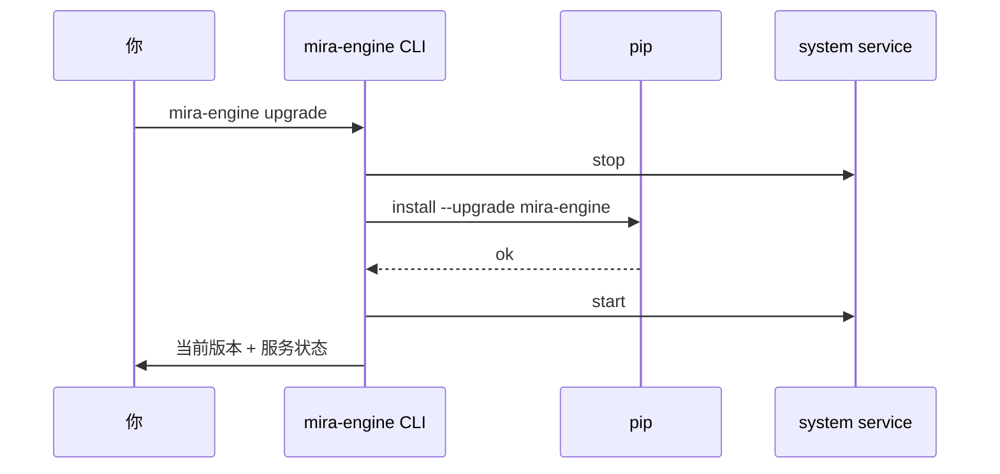

# 本地服务（mira-engine）

## 它解决什么

`mira gateway` 跑在前台终端关掉就停。**`mira-engine`** 把它包装成系统服务（macOS launchd / Linux systemd / Windows Service），让 Mira 像 Docker Desktop 一样开机即用，关掉终端不掉。

> 普通使用不需要它。当你希望关掉终端 Mira 仍在跑、或者想被 Electron UI 自动 spawn，再考虑装。

## 总览



## 两层心智模型

`mira-engine` 把 gateway 的生命周期拆成**注册层**和**运行层**，搞清楚这条边界，剩下的命令就好对号入座：

| 层 | 命令 | 频率 | 作用 |
| --- | --- | --- | --- |
| **注册层** | `install-service` / `uninstall-service` | 一次性 | 在系统服务管理器里登记/注销 Mira，决定"开机是否自启"和"崩溃后是否被拉起" |
| **运行层** | `start` / `stop` | 日常 | 对已注册的服务发"开"/"关"信号，相当于按电源开关 |
| **配置层** | 改 `~/.mira/config.json` | 任意 | gateway **只在启动时读一次** config，没有热重载，必须重启运行层才生效 |



## 一次安装

```bash
mira-engine install-service
```

按平台自动选择实现：

| 平台 | 注册路径 | install 时是否顺带启动 |
| --- | --- | --- |
| macOS | `~/Library/LaunchAgents/com.projectmira.engine.plist` | **是**（plist 含 `RunAtLoad: true`，`launchctl bootstrap` 会立刻起进程） |
| Linux | `~/.config/systemd/user/mira-engine.service` | **否**（只做 `daemon-reload + enable`，需手动 `mira-engine start`） |
| Windows | 服务名 `MiraEngine` | **否**（只写 state，需手动 `mira-engine start`） |
| 其他/降级 | `~/.mira/runtime/agent-service-state.json` | 否（仅文件占位） |

> 都是**用户级**，不需要 sudo。Linux 想要开机自启额外执行一次 `loginctl enable-linger $USER`。

注册项里写死的启动命令是 `python -m mira_engine.cli.commands gateway --host <host> --port <port>` —— **不带 `--config`**，所以总是读默认路径 `~/.mira/config.json`（或环境变量 `MIRA_CONFIG_PATH`）。

`install-service` 何时该重新跑：

- 第一次部署
- 想换注册的 `--host` / `--port`（这些参数被烧进 plist/unit，改 `config.json` 的 `gateway.port` 不会同步过去）
- 升级了打包形态（比如从源码切到 PyInstaller bundle，`sys.executable` 路径变了）

**普通改 config、改模型 key、改 channel 配置都不需要重新 install**，重启运行层就够。

## 日常运维

```bash
mira-engine status      # 当前是否运行 + PID + 端口 + 最近启停时间
mira-engine start       # 启动
mira-engine stop        # 停止
mira-engine logs        # 打印日志文件路径（~/.mira/logs/agent-service.log）
```

### 平台差异：`start` 的"重启"语义

`start` 不是简单的"开机"，跨平台行为不一致，重启时要心里有数：

| 平台 | `mira-engine start` 实际行为 | 已经在跑时再 `start` |
| --- | --- | --- |
| macOS | `launchctl kickstart -k <label>` | **会强杀重启**（`-k` = kill if running, then start） |
| Linux | `systemctl --user start mira-engine.service` | no-op（已运行不会重启） |
| Windows | `subprocess.Popen` 拉起 detached gateway | 检测到 PID 还活着会直接复用，不重启 |

所以"想让 config 生效"的最稳写法是 `stop && start`，所有平台都对；只在 macOS 上单跑 `start` 也行。

### 改完 `config.json` 让新配置生效

gateway 进程**只在启动时读一次** config（参见 `mira_engine/config/loader.py` 的 `load_config`），没有 SIGHUP / 文件 watcher 之类的热重载机制。所以编辑完 `~/.mira/config.json` 后，必须重启运行层：

```bash
# 跨平台通用，最安全
mira-engine stop && mira-engine start

# macOS 也可以只跑这一条（kickstart -k 自带 restart 语义）
mira-engine start
```

> ❌ **不要** 用 `uninstall-service` + `install-service` 来"应用新配置"。那会重写 plist/unit、丢掉开机自启状态、绕一大圈，还会触发 KeepAlive 重新评估。`uninstall-service` 是给"彻底退役"或"换注册参数"用的。

### 速查决策表

| 我想…… | 用什么命令 |
| --- | --- |
| 第一次部署、希望开机自启 | `mira-engine install-service` →（Linux/Windows 再加 `mira-engine start`） |
| 改了 `config.json` 想让新配置生效 | `mira-engine stop && mira-engine start` |
| 临时关掉服务，回头还要再开 | `mira-engine stop` |
| 看当前状态 / 端口 / PID / 启停时间 | `mira-engine status` |
| 排查为什么起不来 | `mira-engine doctor` 或 `mira-engine doctor --export` |
| 升级 mira 包并平滑重启 | `mira-engine upgrade --package mira`（自动 stop → pip → start → /health） |
| 换注册的 host / port | `mira-engine uninstall-service && mira-engine install-service --port <new>` |
| 彻底卸载、不再开机自启 | `mira-engine stop && mira-engine uninstall-service` |

### 启不来时的常见坑

- `start` 之前没跑过 `install-service` → CLI 直接返回 `service is not installed; run install-service first`（exit code 2），不是 bug。
- gateway 自身有 failsafe：检测到 `~/.mira/runtime/gateway.pid` 还在或目标端口被占就会拒启。`stop` 异常退出后偶尔会留下陈旧 PID 文件 / 残余进程，必要时手动 `rm ~/.mira/runtime/gateway.pid` 并 `lsof -i :18790` 清理。
- macOS 上 `KeepAlive: true`：哪怕你 `stop`，launchd 也可能因 crash 把它再拉起来。要长期关掉就走 `uninstall-service`，或者临时 `launchctl bootout gui/$(id -u)/com.projectmira.engine`。

## 升级

```bash
mira-engine upgrade                          # 升 PyPI 上的 mira-engine
mira-engine upgrade --package mira-engine    # 等价（显式指定包名）
```

升级流程：



升级失败时 CLI 会自动尝试重启回旧版本。

## 诊断

```bash
mira-engine doctor              # 屏幕打印诊断结果
mira-engine doctor --export     # 同时导出到 ~/.mira/runtime/diagnostics/<timestamp>.zip
```

`doctor` 会检查：

- Python 版本与依赖（`mira_engine` 包是否能 import）
- 端口占用（`MIRA_GATEWAY__PORT`）
- 配置文件可读性、必填字段
- workspace 读写权限
- Provider key 至少有一个可用（不会真的发请求验证）
- 系统服务注册项是否存在且健康

`--export` 出来的 zip 可以直接发给维护者排障，**不会** 包含 `apiKey` 字段（自动脱敏）。

## 卸载

按"运行层 → 注册层 → 包"的顺序退役：

```bash
mira-engine stop                # 关运行层
mira-engine uninstall-service   # 撤注册层（删 plist/unit、disable 自启）
pip uninstall mira-engine       # 卸 Python 包
```

可选清理：

```bash
rm -rf ~/.mira/logs ~/.mira/runtime
# 项目数据非常宝贵，确认后再删：
# rm -rf ~/.mira/workspace ~/.mira/config.json
```

## 与 Electron UI 的协作

Electron 启动时会按这个顺序找 engine：

1. `MIRA_ENGINE_PATH` 环境变量；
2. `PATH` 上的 `mira-engine`；
3. 安装包内置的 PyInstaller 二进制。

`MIRA-bundle` 首次启动时会自动执行：

1. `mira-engine status`
2. 如未安装则 `mira-engine install-service --port 18790`
3. 如未运行则 `mira-engine start`
4. 轮询 `http://127.0.0.1:18790/health` 和 `/version`

如果你已经手动 `mira-engine install-service` 把后台跑起来了，UI 会直接连 `localhost:18790`，不会重复安装。

> `MIRA-bundle` 只解决“本机使用 mira + mira-ui”这一条路径。若你希望把 agent 部署到远程服务器，仍需在远端机器单独安装 `mira`，然后让 UI 走远程连接模式。对应地，`MIRA-standalone` 更适合远程连接或你已经手动管理本机引擎的场景。

## 验收检查

- [ ] 关掉所有终端后 `curl http://127.0.0.1:18790/api/health` 仍返回 200。
- [ ] 重启电脑后服务自动起来（macOS 自动；Linux 需要 `loginctl enable-linger`；Windows 默认自动）。
- [ ] `mira-engine doctor` 全绿。
- [ ] `mira-engine upgrade` 升级后版本号变化、服务保持运行。
