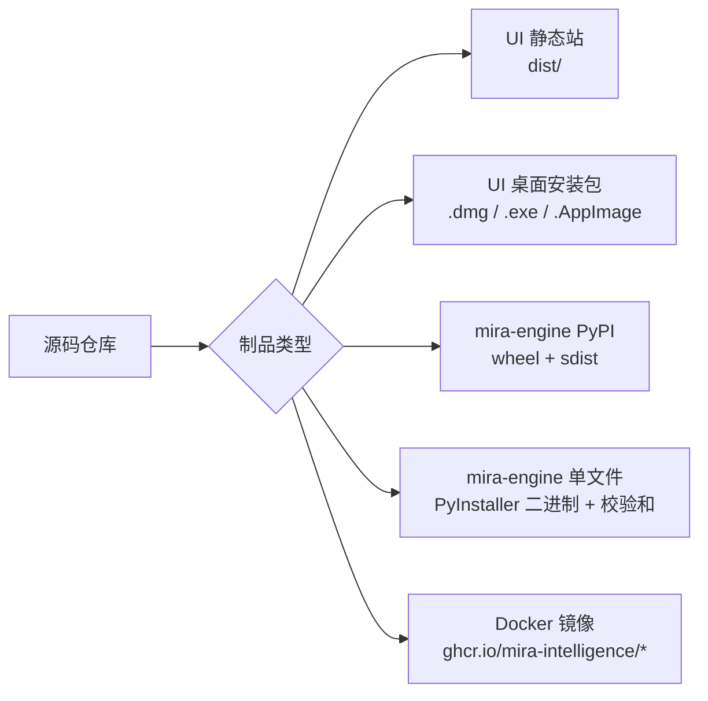
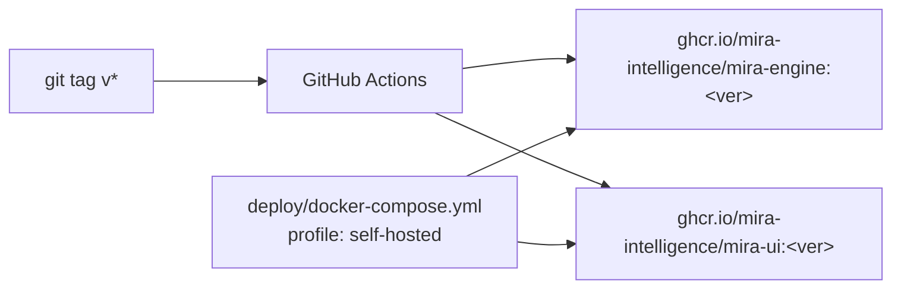

# 打包与发布（Web / Desktop / Engine）

## 这一页解决什么

- `{{PROJECT_UI_NAME}}` 怎么打 Web 静态站 / 桌面安装包？
- `{{PROJECT_CORE_NAME}}` 引擎怎么发到 PyPI？怎么打成单文件可执行？
- 团队 release 流程怎么保证 UI 与 Agent 版本兼容？

## 制品类型一览



| 制品 | 发布工作流 | 触发 |
| --- | --- | --- |
| UI 静态站 | （任意静态托管，一次 `npm run build:web`） | 手动 / CI |
| UI 桌面安装包（`standalone` + `bundle`） | `mira-ui` 仓库 `desktop-release.yml` | 推 tag `v*` |
| UI bundle 手动重建 | `mira-ui` 仓库 `desktop-release-bundle.yml` | `workflow_dispatch` |
| mira-engine PyPI | `mira` 仓库 `agent-release.yml` | 推 tag `v*` |
| mira-engine 单文件二进制 | 同上，`agent-release.yml` 里 PyInstaller 步骤 | 推 tag `v*` |
| 联合 release 校验 | `release-train.yml` (workflow_dispatch) | 手动指定 `agent_tag + ui_tag` |

## 我该下载哪个桌面包

GitHub Release 现在会在**同一个 release 条目**里同时放出 `MIRA-standalone` 和 `MIRA-bundle` 两类桌面资产。

| 你要做什么 | 应选桌面包 |
| --- | --- |
| 连接远程服务器上的 `mira gateway` | `MIRA-standalone` |
| 你已经自己装好了本机 `mira` / `mira-engine` | `MIRA-standalone` |
| 想在同一台电脑上本地开箱即用 | `MIRA-bundle` |
| 想把安装包交给不熟悉 Python / CLI 的同事 | `MIRA-bundle` |

一句话判断：

- `standalone` = 只有 UI，适合远程连接或你自己管理 engine
- `bundle` = UI + 内置本地 engine，适合同机本地使用

## UI 构建命令

```bash
cd mira-ui

# Web 静态站（产物：dist/）
npm run build:web

# Electron 渲染端构建（产物：dist-electron/）
npm run build:electron

# Web + Electron 一把
npm run build:desktop

# 出当前平台 standalone 安装包（产物：release/）
npm run dist

# 出本地整合包（产物：release-bundle/）
npm run dist:bundle:mac
npm run dist:bundle:win
```

standalone 命名约定：

| 平台 | 安装包文件名（约定） |
| --- | --- |
| macOS | `MIRA-standalone-<ver>-mac-<arch>.dmg` |
| Windows | `MIRA-standalone-<ver>-win-<arch>-setup.exe` |
| Linux | standalone `.AppImage`（当前 Linux 仅提供 standalone） |

bundle 命名约定：

| 平台 | 安装包文件名（约定） |
| --- | --- |
| macOS | `MIRA-bundle-<ver>-mac-<arch>.dmg` |
| Windows | `MIRA-bundle-<ver>-win-<arch>-setup.exe` |

`MIRA-bundle` 会把平台对应的 `mira-engine` 单文件二进制一起打包进 Electron 安装包，并在首启时自动注册/拉起本地 service；`MIRA-standalone` 则不会代替你安装本地 engine。

> Electron 元数据在 `mira-ui/package.json`：`name = "mira-ui"`、`productName = "MIRA"`、`appId = "com.projectmira.miraui"`。改了这些会影响安装包标识，请慎重。

## Engine 发布到 PyPI

`pyproject.toml` 已配置 `name = "mira-engine"`、`hatch-vcs` 从 git tag 读版本。

### 一次性：在 PyPI 上预占名（首次）

1. 登录 [PyPI](https://pypi.org)。
2. 在 `Your projects → Manage` 中创建 `mira-engine` 项目。
3. 在 `Publishing → Trusted Publisher` 添加：
   - Owner: `MIRA-Intelligence`
   - Repo: `mira`
   - Workflow file: `.github/workflows/agent-release.yml`
   - Environment: `pypi`

### 日常发版

```bash
# 1) 拉到要发的 commit
git tag v0.2.0
git push origin v0.2.0
```

`agent-release.yml` 会自动：

1. Linux/macOS/Windows 三平台跑测试。
2. `python -m build` 出 wheel + sdist。
3. `pypa/gh-action-pypi-publish` 用 OIDC trusted publishing 发到 PyPI。
4. PyInstaller 出 `mira-engine` 单文件可执行（含 SHA256 校验和），上传到 GitHub Release。文件命名约定：

| 平台 | 二进制文件名 |
| --- | --- |
| Windows (x86_64) | `mira-engine-windows-x86_64.exe` |
| macOS (Apple Silicon) | `mira-engine-macos-arm64` |
| macOS (Intel) | `mira-engine-macos-x86_64` |
| Linux (x86_64) | `mira-engine-linux-x86_64` |

每个文件都附带同名的 `.sha256`。这是普通用户在 [快速开始 → 安装 A 选项](../usage/start.md#1-安装-mira-引擎) 中下载的产物。

> Trusted publishing 不需要存任何 API token；只要 OIDC 配对正确就行。

### 校验本地版本

```bash
pip install mira-engine==0.2.0
mira --version    # 应显示 0.2.0
```

## 兼容性矩阵

UI ↔ Agent 的“契约表”由 **`{{PROJECT_UI_NAME}}` 仓库根目录**的 `compatibility.json` 维护。这个映射由 UI 侧持有，因为依赖方向是 `mira-ui → mira`（UI 调 agent），按惯例由消费者声明跟哪些上游版本兼容。

`{{PROJECT_CORE_NAME}}` 仓库本身**不**参与这个映射，可以独立发版；它对兼容性握手的唯一贡献是 `GET /version` 暴露的 `api_contract` 字段（来源是 `mira_engine/channels/ui.py` 里的 `_API_CONTRACT_VERSION` 常量）。

### 字段含义

| 字段 | 含义 | 何时改 |
| --- | --- | --- |
| `release_train` | release 窗口标识，如 `2026.04` 或 `2026.04rc2` | 每次开新 release window |
| `ui` | 当前 UI tag（`0.3.0rc2`）或 minor range（`0.3.x`） | 打 mira-ui tag 前 |
| `agent` | 当前 agent tag 或 minor range | agent 发新版后 |
| `api_contract` | wire format 的大版本（`v\d+`） | 仅当 wire format 破坏性变更 |
| `min_agent_for_ui` | UI 拒绝连的最低 agent patch | minor 跳变 / 协议要求升级时 |

> `min_agent_for_ui` 是运行时真正会拦版本的那条线——`{{PROJECT_UI_NAME}}` 启动时打 `/version` 拿到 agent 版本后，会跟这个值比对，低于这条线直接判 `incompatible`，弹"引擎需要升级"提示。

### 双层 CI guard（mira-ui 仓库）

| Workflow | 触发 | 干什么 |
| --- | --- | --- |
| `compatibility-check.yml` | push 到 `main`/`dev`/`release` 或 PR，且 paths 命中 `compatibility.json` / 校验脚本 | 仅 schema 校验。约 30s。拦下格式错乱的编辑 |
| `desktop-release.yml#verify-compatibility` | 每次触发本 workflow（包括 tag push） | schema **+** tag push 时额外跑 `--require-ui ${TAG#v}`，要求 `compatibility.json#ui` 跟 tag 一致或落在 minor 范围内 |

`build-standalone` / `build-bundle` / `publish-release` 都 `needs: verify-compatibility`——**文件没改 / 改错就发不出来**。

### 本地校验

```bash
cd mira-ui

# 仅 schema 校验
node scripts/validate-compatibility.mjs --file compatibility.json

# 打 tag 之前预演 tag 校验（接受精确 pin 和 minor range 两种写法）
node scripts/validate-compatibility.mjs \
  --file compatibility.json \
  --require-ui 0.3.0rc3        # 替换成即将打的 UI tag
```

### Release day 实操示例

> 目前这套**还是手动**改 `compatibility.json`。L2 自动化（agent 打 tag → 自动给 mira-ui 开 chore PR）是 roadmap 下一步。

从 `2026.04rc2` 升到 `2026.04rc3`，agent `0.2.0rc4 → 0.2.0rc5`，UI `0.3.0rc2 → 0.3.0rc3`：

```bash
# 1) agent 先发，独立走自己的 pipeline
cd mira
git tag v0.2.0rc5 && git push origin v0.2.0rc5

# 2) mira-ui 改 compatibility.json，开 PR
cd ../mira-ui
# 编辑 compatibility.json：
#   release_train: 2026.04rc2 -> 2026.04rc3
#   ui:            0.3.0rc2   -> 0.3.0rc3
#   agent:         0.2.0rc4   -> 0.2.0rc5
node scripts/validate-compatibility.mjs \
  --file compatibility.json --require-ui 0.3.0rc3
git checkout -b chore/bump-compat-rc3
git add compatibility.json
git commit -m "chore(compat): bump release train to 2026.04rc3"
git push -u origin chore/bump-compat-rc3
gh pr create --base dev --title "chore(compat): bump release train to 2026.04rc3"
# compatibility-check.yml 自动跑 schema 校验 → 绿了 review 合并

# 3) mira-ui 打 tag
git checkout dev && git pull
git tag v0.3.0rc3 && git push origin v0.3.0rc3
# desktop-release.yml#verify-compatibility 拿 0.3.0rc3 跟文件比对
# 通过则继续 build / publish；不一致直接拦下整条 pipeline

# 4)（可选）跑联合 smoke 端到端验证
gh workflow run release-train.yml \
  -f agent_tag=v0.2.0rc5 \
  -f ui_tag=v0.3.0rc3
```

### Wire format 破坏性变更的特殊流程

如果当次 release 改了 wire format（删字段 / 改 enum / 改 endpoint shape），需要协调两仓：

1. **mira**：改 `mira_engine/channels/ui.py` 里的 `_API_CONTRACT_VERSION = "v1"` → `"v2"`，agent 打 tag，独立发版
2. **mira-ui**：改 `engine.ts` 里检查的常量来源（`compatibility.json#api_contract` `"v1"` → `"v2"`），回测兼容旧 agent 不再连得上（这正是 `api_contract` 大版本要做到的事），打 tag

旧 UI 连新 agent / 新 UI 连旧 agent，会被 `engine.ts` 的 `probeEngineCompatibility` 直接判 `incompatible`，弹"API 契约不兼容"。

## Docker 镜像



镜像名约定：

- `ghcr.io/mira-intelligence/mira-engine:<ver>`
- `ghcr.io/mira-intelligence/mira-ui:<ver>`
- `ghcr.io/mira-intelligence/mira-engine:latest`
- `ghcr.io/mira-intelligence/mira-ui:latest`

## 验收检查（每次发版）

- [ ] CI 三平台测试全绿（Windows asyncio noise 已被 `pyproject.toml` 的 `filterwarnings` 抑制，不再造成误报）。
- [ ] `pip install mira-engine==<ver>` 可装；`mira --version` 显示新版本。
- [ ] 桌面安装包在 macOS/Windows/Linux 三种系统上至少抽查能启动。
- [ ] `mira-ui/compatibility.json` 已更新到本次 release，`node scripts/validate-compatibility.mjs --file compatibility.json --require-ui <tag>` 在本地通过；mira-ui 仓库的 `verify-compatibility` job 在 tag push 上也是绿。
- [ ] GitHub Release 页面有：wheel、sdist、3 平台 PyInstaller 二进制 + 对应 `.sha256`。
