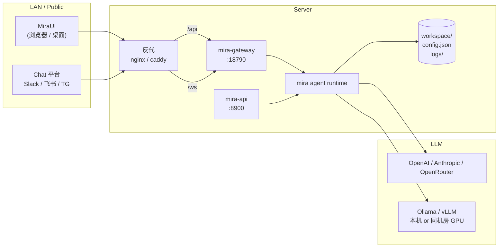

# 自托管部署（Self-hosted）

## 何时该走自托管

- 团队多人共用一份 Mira 后端 / 工作区。
- 需要从内网或外网稳定访问（不依赖某个人的笔电）。
- 想接入飞书/Slack/Telegram 等 channel，让 Agent 在群里直接响应。
- 需要 GPU 服务器跑本地 Ollama / vLLM。

## 推荐架构



## 用 docker-compose（最快）

仓库里 `deploy/` 目录包含开箱即用的模板：

```
deploy/
├── docker-compose.yml
├── Dockerfile
├── entrypoint.sh
└── .env.example
```

### 1) 准备环境变量

```bash
cd mira/deploy
cp .env.example .env
```

`.env` 中至少填：

```bash
# 任选一个或多个 provider
MIRA_PROVIDERS__OPENROUTER__API_KEY=sk-or-v1-...
MIRA_PROVIDERS__ANTHROPIC__API_KEY=sk-ant-...

# 默认模型
MIRA_AGENTS__DEFAULTS__MODEL=anthropic/claude-sonnet-4-5

# 工作区挂载点（容器内路径）
MIRA_AGENTS__DEFAULTS__WORKSPACE=/data/workspace

# Gateway / API 端口
MIRA_GATEWAY__PORT=18790
MIRA_API__PORT=8900
```

### 2) 启动核心服务

```bash
docker compose up -d mira-gateway mira-api
docker compose logs -f mira-gateway
```

服务列表（核心 + 自托管 release profile）：

| 服务 | 用途 | 默认端口 |
| --- | --- | --- |
| `mira-gateway` | WebSocket + REST 后端 | `18790` |
| `mira-api` | OpenAI 兼容 API（可选） | `8900` |
| `mira-cli` | 一次性命令容器（手动 `exec` 用） | — |
| `mira-engine` *(profile: self-hosted)* | 直接运行打包好的 release 镜像 | `18790` |
| `mira-ui` *(profile: self-hosted)* | 静态 UI + 反代 | `80` |

需要起 release 全家桶：

```bash
docker compose --profile self-hosted up -d
```

### 3) 暴露给前端 / nginx 反代

最小 nginx 片段：

```nginx
server {
  listen 80;
  server_name mira.example.com;

  # 静态前端
  root /var/www/mira-ui;
  index index.html;

  location / { try_files $uri /index.html; }

  # REST
  location /api/ {
    proxy_pass http://127.0.0.1:18790;
    proxy_http_version 1.1;
    proxy_set_header Host $host;
  }

  # WebSocket
  location /ws {
    proxy_pass http://127.0.0.1:18790;
    proxy_http_version 1.1;
    proxy_set_header Upgrade $http_upgrade;
    proxy_set_header Connection "upgrade";
    proxy_read_timeout 1h;
  }
}
```

UI 侧通过 `VITE_API_URL=https://mira.example.com` + `VITE_WS_URL=wss://mira.example.com/ws` 接入。

### 4) 持久化卷

`docker-compose.yml` 默认把以下路径挂出来：

| 容器内 | 推荐主机路径 | 内容 |
| --- | --- | --- |
| `/data/workspace` | `/srv/mira/workspace` | 项目数据（**最重要**，必须持久化） |
| `/data/config.json` | `/srv/mira/config.json` | 主配置（含 key） |
| `/data/logs` | `/srv/mira/logs` | 日志轮转 |

> 备份策略：`workspace/` 与 `config.json` 每天 rsync 到对象存储；`logs/` 可不备。

## 不用 Docker — 直接系统服务

适合小团队 / 单机：见 [本地服务（mira-engine）](local-engine-service)。它会注册一个 launchd / systemd / Windows Service，开机自启 `mira gateway`。

## 安全 checklist

- [ ] **绝不**把 `mira gateway` 的 `0.0.0.0:18790` 直接对公网暴露；前面必须有 nginx + HTTPS + 鉴权。
- [ ] `~/.mira/config.json` 中的 API key 用文件权限 600 保护；或全部走环境变量。
- [ ] `tools.restrictToWorkspace = true`（默认开），不要关。
- [ ] `tools.exec.sandbox = "bwrap"`（仅 Linux 容器内）可加一层进程隔离。
- [ ] 定期 `mira-engine doctor --export` 留诊断 bundle。

## 验收检查

- [ ] `curl http://<host>:18790/api/health` 返回 200。
- [ ] 浏览器从外部访问 UI，能看到项目列表 + WebSocket 显示绿。
- [ ] 重启 docker / 重启服务器后，所有数据与项目状态保留。
- [ ] 任意用户的浏览器都看到一致的项目状态（说明真的在共享后端）。
