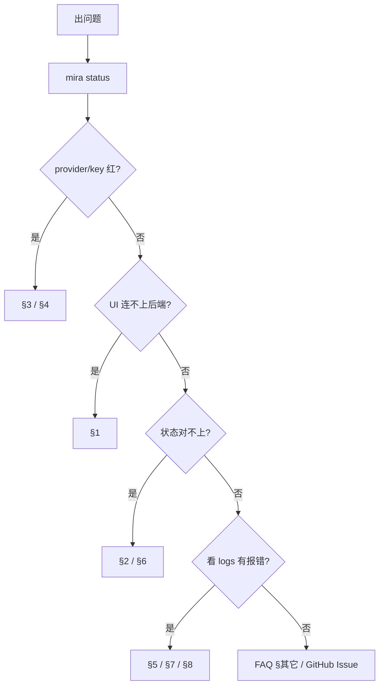

# FAQ 与故障排查

> 90% 的问题用以下三步定位：
> 1. `mira status` — 配置与 provider 是否健康。
> 2. 看 `~/.mira/logs/agent-service.log` 最近 50 行。
> 3. 直接打开有问题项目的 `~/.mira/workspace/PRJ-xxxx/task_plan.json`，对比 UI 显示。



---

## 1. UI 无法连接后端

**症状**：右上角连接指示长时间灰/红；项目列表加载转圈。

如果你连接的是**远程部署的 mira-agent / mira gateway**，先优先排这两件事：

1. **先检查远程服务器和本地电脑的防火墙 / 安全组**
   - 远程服务器是否允许 `18790`（或你自定义的端口）入站？
   - 你本地电脑所在网络、公司 VPN、云服务器安全组、系统防火墙是否拦了这个端口？
   - 最直接的测试方式是在本地电脑上执行：
     ```bash
     curl http://<remote-host>:18790/api/health
     ```
     如果这里都超时或拒绝连接，UI 一定也连不上。
2. **局域网内访问远端机器时，后端必须监听 `0.0.0.0`，不能只绑 `127.0.0.1`**
   - 如果远端日志里看到的是：
     ```text
     Starting mira gateway on 127.0.0.1:18790
     ```
     那就只允许服务器本机访问，局域网内其他机器看不到。
   - 应改成：
     ```bash
     mira gateway --host 0.0.0.0 --port 18790
     ```
     或安装服务时：
     ```bash
     mira-engine install-service --host 0.0.0.0 --port 18790
     ```
   - 这样局域网内其他机器才能通过 `http://<server-ip>:18790` 连上。

> 注意：`0.0.0.0` 适合局域网 / 内网可达场景；**不要**把未经鉴权的 `18790` 直接暴露到公网。

排查顺序：

1. 后端起了吗？
   ```bash
   curl http://localhost:18790/api/health
   # 期望返回 {"status":"ok",...}
   ```
2. 端口对吗？UI 的 `VITE_API_URL` / `VITE_WS_URL` 与 `mira gateway --port` 一致？
3. 如果是远程 / 局域网访问，确认后端绑定的不是 `127.0.0.1`，而是 `0.0.0.0`。
4. 跨域被挡了吗？自托管反代时 nginx 的 `/ws` location 必须带 `Upgrade` / `Connection: upgrade`，详见 [自托管部署](../deployment/self-hosted.md)。
5. 防火墙 / VPN 拦了 18790？`lsof -iTCP:18790 -sTCP:LISTEN` 验证后端在听；浏览器 DevTools → Network → WS 看握手响应码。

## 2. 项目状态不一致（UI vs 文件）

**症状**：UI 显示 Running，但 `task_plan.json` 里 `status: completed`；或反过来。

1. 在项目页点 “刷新计划”，强制走 REST 重拉。
2. 不行就重启 UI（Web 模式刷浏览器；Desktop 模式 `Cmd/Ctrl+R`）。
3. 还不行就以 `task_plan.json` 为准。可能是 WS 短暂断开漏推。
4. 长期反复出现 → 检查后端日志中 `task_plan.update` 事件是否正常发出。

详见 [实时同步机制](../usage/ui/realtime-sync.md) 与 [任务计划与状态同步](../usage/ui/task-plan-and-status.md)。

## 3. Provider 401 / 403 / “Unauthorized”

1. `mira status` 看 provider 是否被识别（key 显示前缀即正常加载）。
2. 直接 `curl` 验证 key 本身有效（OpenAI / Anthropic 都有最小测试 endpoint）。
3. `provider: "auto"` 时是不是被自动匹配到了错的家？显式写 `provider: "openrouter"` 等。
4. Azure OpenAI 必须给 `apiBase` + `extraHeaders.api-version`；model 字段是 deployment 名而非模型名。

详见 [Provider 与运行时参数](../usage/agent-config/providers-and-runtime.md)。

## 4. “实验都完成了但项目没 completed”

**核心结论**：项目 completed 不是看实验，是看 **最终结果交付物存在**。

按这个顺序检查：

1. `task_plan.json.result.output_path` 是否非空？
2. `result.output_type` 是否在 `experiment_report` / `paper_article` / `presentation` / `metadata` 之内？
3. `output_path` 指向的文件在磁盘上真的存在？
4. 任一条不满足 → 进 Result 阶段重新触发一次导出。

详见 [结果导出中心](../usage/ui/result-center.md)。

## 5. guardrail 反复提示缺字段

1. 在 [实验详情面板](../usage/ui/experiment-detail.md) 定位是哪几个字段缺。
2. 直接在 UI 里给出具体文字（不要写 `TODO` / `待补充`，guardrail 把它们当“没填”）。
3. 如果 strict 太严打扰节奏，临时切回 `contract_version: v1` 走完探索期，再升回 strict 让 guardrail 一次补齐。
4. 自动修复 3 次仍失败 → 切到 `manual` 模式，给 Agent 一段补充 prompt 指明该字段含义。

详见 [Guardrail 与自动修复](../usage/ui/guardrail-and-auto-repair.md)。

## 6. 端口被占（5173 / 18790 / 8900）

```bash
# macOS / Linux
lsof -iTCP:18790 -sTCP:LISTEN
kill -9 <pid>
```

或换端口：

```bash
mira gateway --port 28790
npm run dev -- --port 5174
```

UI 端要同步 `VITE_API_URL` / `VITE_WS_URL`。

## 7. Channel 配完没反应（Telegram / 飞书 / Slack）

通用顺序：

1. `mira channels status` 显示该 channel 是 `connected` 吗？
2. 看 `~/.mira/logs/agent-service.log` 中以 channel 名开头的行（如 `telegram: ...`）。
3. 群里只 “@bot” 还是普通消息？`groupPolicy: mention` 必须 @；`open` 才响应所有消息。
4. `allowFrom` 里有没有把你自己加进去？空数组 = 不限制；非空 = 严格白名单。
5. 飞书事件回调 401 → 仔细比对 `verificationToken` / `encryptKey`，注意尾部空格。
6. Slack `socket` 模式不需要公网；`events` 模式必须有公网回调地址。

详见 [Channel 配置](../usage/agent-config/channels.md)。

## 8. Windows CI / 本地有 `Event loop is closed` 警告

**症状**：

```
PytestUnraisableExceptionWarning: Exception ignored in: <function BaseSubprocessTransport.__del__>
RuntimeError: Event loop is closed
```

这是 Windows `ProactorEventLoop` 在子进程清理时的已知 noise，**测试本身是通过的**，但 GitHub Actions 因为字符串里有 `Error:` 把它误标成 Error。

`mira` 仓库的 `pyproject.toml` 已经加了 `filterwarnings` 抑制它：

```toml
[tool.pytest.ini_options]
filterwarnings = [
    "ignore:Exception ignored in.*BaseSubprocessTransport.*:pytest.PytestUnraisableExceptionWarning",
]
```

如果你 fork 后跑测试还看到这条，确认本地 `pyproject.toml` 与上游同步即可。

## 9. `mira agent` 卡在某一步、不出输出

1. 加 `--logs --verbose` 重跑，看到底卡在哪个工具调用。
2. 是 `web.search` 卡住？检查代理 / 公司网；或换 `provider: duckduckgo` 试试。
3. 是 `exec` 卡住？很可能某条 shell 没 timeout。`tools.exec.timeout` 默认 60 秒，长任务可调到 600。
4. 是 LLM 调用卡住？看 provider 是否限流；切到候选模型。

## 10. 从 MedPilot 升级后没自动迁移

正常情况下第一次跑 `mira` 任意命令时会自动迁移。如果没生效（最常见原因：你新机器上 `~/.mira/` 已经存在，迁移会跳过避免覆盖）：

```bash
# 备份新生成的（往往是空的）~/.mira
mv ~/.mira ~/.mira.bak

# 把旧的搬过来
mv ~/.medpilot ~/.mira
echo "manual-migrate $(date)" > ~/.mira/.migrated-from-medpilot

# 验证
mira status
```

环境变量类似：把 shell rc 里所有 `MEDPILOT_*` 改成 `MIRA_*`。

## 11. UI localStorage / 设置丢了

UI 设置存在浏览器 `localStorage`，key 为 `mira-ui-settings`。从 MedPilot 升级时会自动从 `medpilot-ui-settings` 拷贝过来。

如果手动清理过浏览器缓存，需要重新在设置页配置 API 地址 / 主题等；项目数据本身在后端 `~/.mira/workspace/` 不会丢。

## 12. Docker 起不来：`Mounts denied` / 权限错误

macOS Docker Desktop 默认只允许挂载 `/Users` 等几个目录。如果你把 workspace 放在 `/data/`，需要在 Docker Desktop → Settings → Resources → File Sharing 添加。

Linux 上常见是 SELinux / AppArmor。临时排查：`docker compose up -d --user $(id -u):$(id -g)`，确认非权限问题后再调 SELinux 策略。

## 13. Ollama / 本地模型连不上

```bash
curl http://localhost:11434/api/tags    # 应返回模型列表
```

- 没返回 → Ollama 没起，`ollama serve` 一下。
- 返回空数组 → 还没拉模型，`ollama pull qwen2.5:14b`。
- 在 Mira 里报 model not found → `agents.defaults.model` 写的名字必须和 `ollama list` 完全一致（带 tag，例如 `qwen2.5:14b`）。

## 14. `mira-engine` 装为系统服务后，重启电脑没自启

| 平台 | 处理 |
| --- | --- |
| macOS | 默认就该自启。如果没有，`launchctl bootstrap gui/$(id -u) ~/Library/LaunchAgents/com.projectmira.engine.plist` |
| Linux | 用户级 systemd 默认登录退出就停。`loginctl enable-linger $USER` 后才会一直在 |
| Windows | 默认服务就是 “自动”。在服务管理器里确认 `MiraEngine` 启动类型是 “自动” |

详见 [本地服务（mira-engine）](../deployment/local-engine-service.md)。

## 15. 还没解决？

1. 跑一次 `mira-engine doctor --export`，把 `~/.mira/runtime/diagnostics/<timestamp>.zip` 附上。
2. 在 [GitHub Issues](https://github.com/{{PROJECT_ORG_NAME}}/mira/issues) 搜一下关键词；没人提过就开新 issue，附 `mira --version` + 操作步骤 + 上面那份 zip。
3. 紧急情况下回退到上一个稳定版本：`pip install "mira-engine==<上一稳定版本>"`，UI 同步降版本，参考 `compatibility.json`。
