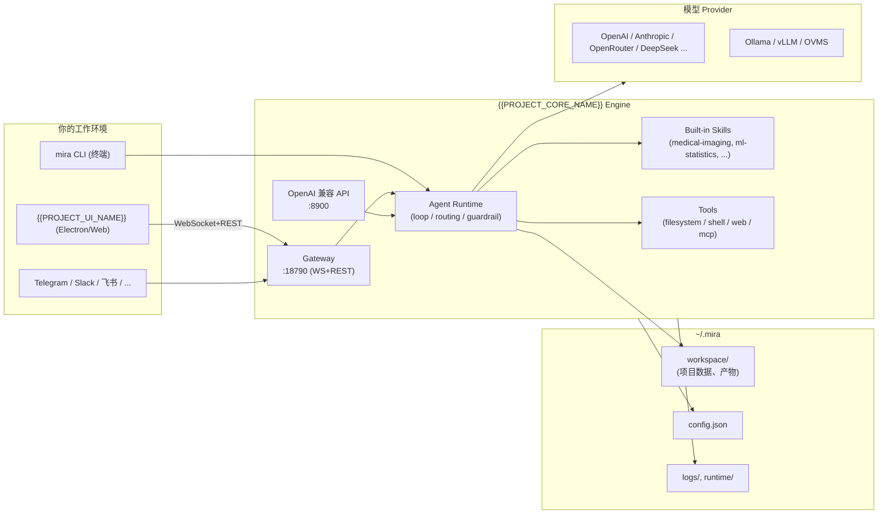

import Tabs from '@theme/Tabs';
import TabItem from '@theme/TabItem';

# {{PROJECT_DOCS_NAME}}

`{{PROJECT_CORE_NAME}}` 是面向 **医学 AI 研究** 的轻量级开源 Agent 框架；`{{PROJECT_UI_NAME}}` 是它的桌面/Web 操作台。本站把两者的安装、配置、运行、部署、排障汇总到一处，帮你从“拿到代码”到“跑出第一个项目交付物”最快只用 10 分钟。

> **现在你在哪里？**
> - 第一次接触 `{{PROJECT_CORE_NAME}}`：直接进入 [快速开始](./usage/start.md)。
> - 想理解“项目 / 实验 / 任务计划 / Profile” 这些术语：先看 [核心概念](./concepts.md)。
> - 已经在用，需要调模型/Provider：去 [Agent 配置](./usage/agent-config/README.md)。
> - 准备上线/打包：去 [部署](./deployment/README.md)。
> - 出问题了：去 [FAQ 与故障排查](./faq/troubleshooting.md)。

---

## 它能做什么

`{{PROJECT_CORE_NAME}}` 把医学 AI 研究的常见动作（数据梳理 → 训练 → 评估 → 报告）封装成可由 Agent 自动驱动的 **技能（skills）**，并以工程化的方式管理它们的执行：

- **端到端医学影像深度学习管线**：DICOM/NIfTI 预处理、MONAI/PyTorch 分类·分割·检测、5 折交叉验证、early stopping。
- **影像组学**：PyRadiomics 提特征 + LASSO/mRMR 选特征。
- **生存分析**：Kaplan–Meier、Cox 比例风险模型（lifelines）。
- **科研写作**：文献综述、论文初稿、答辩 PPT、实验报告导出。
- **可控的 Agent 运行时**：模型路由、工具回合上限、工作区沙箱、guardrail 字段校验、自动修复回合。
- **多通道接入**：Telegram / Slack / Discord / 飞书 / 钉钉 / 邮件 / Web 等内置 channel。

## 系统组件总览

*图 1：`{{PROJECT_CORE_NAME}}` 的组件与数据流。一切产物都落在 `~/.mira/workspace` 内，便于追溯与归档。*

## 三类典型用法

<Tabs>
  <TabItem value="ui" label="桌面 UI（推荐研究者）" default>

最常见路径：装好 `{{PROJECT_CORE_NAME}}` 引擎 → 启动 `{{PROJECT_UI_NAME}}` → 在 UI 里创建项目 → 让 Agent 自动跑 → 在 Result 阶段导出。

适合：临床科研 / 影像组 / 学生组 — 不想写命令行，想看进度可视化。

入口：[快速开始](./usage/start.md) → [UI 功能总览](./usage/ui/index.mdx)

  </TabItem>
  <TabItem value="cli" label="终端 CLI（开发者 / 一次性脚本）">

直接 `mira agent -m "..."` 单次驱动，或 `mira gateway` 拉起服务后自己写脚本通过 REST/WS 调用。

适合：原型开发 / CI / 把 Mira 嵌入已有流水线。

入口：[CLI 命令参考](./cli-reference.md) → [Provider 与运行时](./usage/agent-config/providers-and-runtime.md)

  </TabItem>
  <TabItem value="server" label="自托管 / 团队共享">

用 `deploy/docker-compose.yml` 在团队服务器上启动 `mira-gateway` + `mira-ui`，多人通过同一份后端协作；可选挂上 chat channel（飞书/Slack/Telegram）让 Agent 直接在工作群里响应。

适合：实验室 / 公司内部团队。

入口：[自托管部署](./deployment/self-hosted.md) → [Channel 配置](./usage/agent-config/channels.md)

  </TabItem>
</Tabs>

## 推荐起步路线

1. 完成 [快速开始](./usage/start.md)（约 10 分钟，含装环境）。
2. 熟悉 [核心概念](./concepts.md) 与 [UI 功能总览](./usage/ui/index.mdx)。
3. 跑通第一个 [结果导出](./usage/ui/result-center.md)。
4. 按需精修 [Agent 配置](./usage/agent-config/README.md) 或部署 [自托管](./deployment/self-hosted.md)。
5. 出问题查 [FAQ 与故障排查](./faq/troubleshooting.md)。

> **从 MedPilot 升级而来？** 启动新版本时 `{{PROJECT_CORE_NAME}}` 会自动把 `~/.medpilot/` 迁移到 `~/.mira/`，并对 `MEDPILOT_*` 环境变量做一次性兼容映射；UI 的 `localStorage` 设置也会自动迁移。如果发现没生效，请按 [FAQ §10](./faq/troubleshooting.md) 手动迁移。

---

*文档版本基线：`{{PROJECT_CORE_NAME}}` 0.1.x · `{{PROJECT_UI_NAME}}` 0.1.x · API contract `v1`。*
