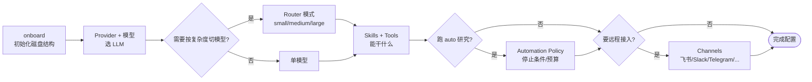

# Agent 配置

本节覆盖 `{{PROJECT_CORE_NAME}}` 的全部运行时配置：从初始化、模型/Provider 选择，到调用工具与外部 channel。

## 页面列表

| 页面 | 何时看 |
| --- | --- |
| [onboard 与 workspace 初始化](./onboard-and-workspace.md) | 第一次安装；想换 workspace 位置；从 MedPilot 迁移 |
| [Provider 与运行时参数](./providers-and-runtime.md) | 切模型/换供应商；调温度、回合上限、上下文窗口 |
| [模型路由（router）模式](./model-router.md) | 想让"小问题走便宜模型" |
| [Skills 与 Tools](./skills-and-tools.md) | 想知道有哪些技能可调用、怎么挂自定义 MCP server |
| [Auto 模式与 Automation Policy](./automation-policy.md) | 跑 `mira research --mode auto`；UI 自动多轮研究；想配停止条件/预算 |
| [Channel 配置](./channels.md) | 想把 Agent 接到飞书/Slack/Telegram/钉钉/邮件 |

