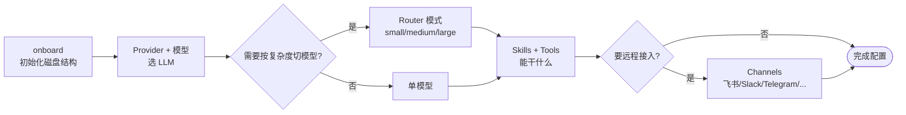

# Agent 配置

本节覆盖 `{{PROJECT_CORE_NAME}}` 的全部运行时配置：从初始化、模型/Provider 选择，到调用工具与外部 channel。

## 页面列表

| 页面 | 何时看 |
| --- | --- |
| [onboard 与 workspace 初始化](onboard-and-workspace) | 第一次安装；想换 workspace 位置；从 MedPilot 迁移 |
| [Provider 与运行时参数](providers-and-runtime) | 切模型/换供应商；调温度、回合上限、上下文窗口 |
| [模型路由（router）模式](model-router) | 想让“小问题走便宜模型” |
| [Skills 与 Tools](skills-and-tools) | 想知道有哪些技能可调用、怎么挂自定义 MCP server |
| [Channel 配置](channels) | 想把 Agent 接到飞书/Slack/Telegram/钉钉/邮件 |

