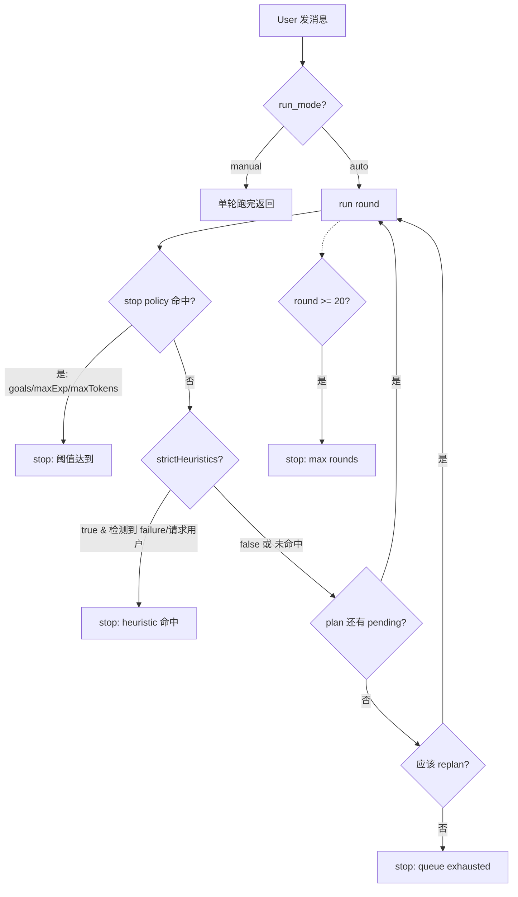

# Auto 模式与 Automation Policy

## 这一页解决什么

- `mira research --mode auto` 到底什么时候停？为什么会"提前停"？
- `automation_policy` 怎么写？`goals` / `maxExperiments` / `maxTokens` / `strictHeuristics` 各管什么？
- 项目状态为什么一直停在 `in_progress`，明明 agent 说"任务完成"了？
- UI 状态栏显示的"已用 token / 总预算"是哪里来的？

> 仅 `mira research` 与 UI/API 后端用的 `ResearchAgentLoop` 走 auto 流水线。`mira agent`（`BaseAgentLoop`）不读 `automation_policy`，永远是单轮跑完就返回。

## 顶层模型



每次 round 结束后决策一次"要不要再来一轮"。`_AUTO_MAX_ROUNDS = 20` 是**硬上限**（写死在代码里，不可配置），无论怎么配 policy 都会被它兜住。

## 配置入口

`automation_policy` 可以从三处注入，**优先级从高到低**：

1. **inbound message metadata**（UI / API 客户端每次 send 时带上）—— 会同时持久化到 `<project>/.mira/project.json`。
2. **`<project>/.mira/project.json`** 里的 `automation_policy` 字段 —— UI 启动一个 session 时会从这里读默认值。
3. **`mira research` CLI 短参**（`--max-tokens` / `--max-experiments`）—— 仅当前进程，不写盘；自动包成最小合法 policy（`logic: "AND"`、`goals: []` 加上对应阈值）。

`mira research` 当前**没有** `--goals` / `--strict-heuristics` 短参，要用这两个字段请直接编辑 `project.json` 或通过 UI 的"Automation Policy"面板设置。

## `automation_policy` schema

```json
{
  "automation_policy": {
    "logic": "AND",
    "goals": [
      { "metric": "Mean R", "operator": ">", "value": 0.8 },
      { "metric": "Val ACC", "operator": ">=", "value": 0.92 }
    ],
    "maxExperiments": 30,
    "maxTokens": 2000000,
    "strictHeuristics": true
  }
}
```

| 字段 | 类型 | 默认 | 说明 |
| --- | --- | --- | --- |
| `logic` | `"AND"` / `"OR"` | `"AND"` | 多 goals 的合并方式：`AND` 全部命中才停；`OR` 任一命中就停。大小写不敏感 |
| `goals` | `Goal[]` | `[]` | 数值型停止目标列表，见下表。空数组等同于"不靠 goals 停" |
| `maxExperiments` | int >0 / null | null | 完成 N 个 experiment（`status` ∈ `"completed"` / `"finished"` 等终态）后停 |
| `maxTokens` | int >0 / null | null | 当前 session 累计 token 超过此值后停 |
| `strictHeuristics` | bool | `true` | 是否启用文本启发式停止（detect "failure" / "请用户确认" 句式）。长任务建议 `false` |

`Goal` 形状：

| 字段 | 类型 | 说明 |
| --- | --- | --- |
| `metric` | string | 必须与 `task_plan.json` 中 experiment 的 `metrics.<key>` 完全一致（区分大小写、空格保留） |
| `operator` | string | 五选一：`>`, `>=`, `<`, `<=`, `==` |
| `value` | number | 阈值。引擎会 `float()` 转换 task_plan 里的 metric 值再比较 |

> 引擎只看**最后一个 completed experiment** 的 metrics（`_collect_latest_plan_metrics`），不是历史最佳。如果你想"任意一次达标就停"，写多个 experiment 然后看最后一次就行；想"连续 3 次达标"目前需要在 task_plan 里手动表达。

### 字段全为空 = 没 policy

如果 `goals` 空、`maxExperiments` 没设、`maxTokens` 没设、`strictHeuristics` 也没显式设，引擎认为"没有 policy"，等价于 `null`。这种情况下：

- `_AUTO_MAX_ROUNDS = 20` 仍兜底；
- `strictHeuristics` 默认 `true`，启发式照样跑；
- 队列空了**会 replan**（保留 nanobot 风格的"自动续作"行为）。

## 停止判定（precedence）

每次 round 结束按以下顺序判断：

1. **task_plan guardrail blocking** —— 若 `task_plan.json` 经 `guard_task_plan_file` 检查后 blocking，直接停。`stop_reason = "task_plan guardrail blocking"`。
2. **max rounds** —— `auto_round >= _AUTO_MAX_ROUNDS`（=20）。`stop_reason = "max rounds reached (20)"`。
3. **strictHeuristics 启发式**（仅当 `strictHeuristics=true` 时启用）：
   - `failure heuristic` —— 关键词命中。`stop_reason = "failure heuristic matched"`。
   - `user-input heuristic` —— 关键词命中。`stop_reason = "user-input heuristic matched"`。
4. **automation goals reached** —— 所有 `goals` 满足（按 `logic` 合并）。`stop_reason = "automation goals reached"`。
5. **max experiments reached** —— `completed >= maxExperiments`。`stop_reason = "max experiments reached (N/M)"`。
6. **max tokens reached** —— `tokens_used_session >= maxTokens`。`stop_reason = "token budget reached (N/M)"`。
7. **queue exhausted** —— pending 队列空且 replan 条件不满足。`stop_reason = "queue exhausted, no replan condition met"`。

`stop_reason` 字符串会以 `auto-run stop condition: <reason>` 或 `auto-run stop reason: <reason>` 形式作为 progress 消息发到 UI / 终端，同时也写到 logs。

## Replan 规则（队列空了之后）

当 `task_plan.experiments` 里没有 `pending` / `running` 状态的 experiment 了，引擎走 `_should_replan_exhausted_queue`：

| 情况 | 行为 |
| --- | --- |
| 还有 pending/running | 不 replan（caller 自己继续） |
| 没 policy（`automation_policy: null`） | **会 replan**（受 `_AUTO_MAX_ROUNDS` + heuristics 兜底） |
| 有 policy 且停止条件已命中 | 不 replan |
| 有 policy + `goals` 未达 | **会 replan**（不论 `maxExperiments` 是否设） |
| 有 policy + `maxExperiments` 还有预算 | **会 replan**（直到 `completed >= maxExperiments`） |
| 只设了 `maxTokens` / `strictHeuristics`，没 goals/budget | **会 replan**（受 `maxTokens` 与 max rounds 兜底） |

> 这条规则是 v0.3 的关键变化（PR #71）：**老行为是"必须设 `maxExperiments` 才会 replan"**，意味着 goal-driven session 没设 budget 时只要模型忘了往队列加新 experiment 就会卡死。新版默认更激进、更倾向于"继续干"，靠硬上限 + 启发式兜底而不是靠"模型自觉续作"。

## `strictHeuristics` —— 长任务的逃生口

`strictHeuristics: true`（默认）开启两类基于 closing paragraph 的关键词检测：

**`_looks_like_user_input_request`** —— 只看最后一个 `\n\n` 段落（截断到 600 字符），命中以下任一关键词就停：

| 类别 | 关键词 |
| --- | --- |
| EN（明确请求确认） | `please confirm`, `please choose`, `please provide`, `could you provide`, `could you confirm`, `can you provide`, `need your input`, `awaiting your input`, `awaiting your confirmation`, `what would you like to do next`, `shall i proceed`, `should i proceed`, `do you want me to` |
| ZH（明确请求确认） | `请提供`, `请确认`, `请选择`, `是否继续`, `是否开始`, `是否要我`, `等待你的确认`, `等待用户` |

**`_looks_like_failure_response`** —— 命中即停：

| 信号类型 | 关键词（位置） |
| --- | --- |
| Hard signals（任意位置） | `traceback (most recent call last)`, `sorry, i encountered an error`, `memory archival failed`, `tool call failed`, `unrecoverable error`, `无法继续` |
| Soft signals（仅 closing paragraph） | `i'm/i am unable to proceed`, `cannot proceed because`, `cannot continue because`, `i cannot continue`, `blocked by ` |

> v0.3 之前的关键词列表激进得多——`could you`, `clarify`, `需要你`, `exit code:`, `module not found`, `permission denied`, `出现错误` 都会触发。结果是 stdout 里出现一行 "module not found" 就把 auto 模式打断。PR #70 把列表收紧到上面这些，并加上了 `strictHeuristics` 开关让你彻底关掉。

### 什么时候关 `strictHeuristics`

设 `false` 后，**只剩下硬阈值**（goals / maxExperiments / maxTokens / max rounds / task_plan guardrail）能停止 auto 循环。适用场景：

- **跑深度学习训练 / 长仿真**：日志里 `"exit code: 1"` 是常态，不该停。
- **多步 debug 回路**：模型会自我反思 "blocked by"、"module not found"，这些应该让它继续 fix。
- **批量数据处理**：希望跑到 `maxExperiments` 或 `maxTokens` 用完为止，不要被措辞影响。

不建议关的场景：

- **交互式探索**：你需要 agent 主动停下来征求方向时。
- **没设任何硬阈值的 session**：关掉 `strictHeuristics` 又没 budget，跑飞了只能等 `_AUTO_MAX_ROUNDS = 20` 兜底，会浪费 token。

```json
{
  "automation_policy": {
    "logic": "AND",
    "goals": [],
    "maxExperiments": 50,
    "maxTokens": 5000000,
    "strictHeuristics": false
  }
}
```

## Export Guards（auto 不会"自己宣布完成"）

v0.3 起 UI channel 加了两层 guard，**避免 auto 模式在用户没说"导出"时就把项目标记成 completed**：

### 1. `task_plan.result` 写入需要显式触发

`auto-run` round 结束后，如果 inbound message **不属于** "result request"，引擎会**回滚** `task_plan.result` 字段到 round 开始时的状态，并 progress 一句：

```text
auto-run guard: skipped task_plan.result update without explicit export request
```

判定为 "result request" 的条件（`_looks_like_result_request`）—— 任一命中即可：

- inbound metadata 显式设了 `_allow_result_write: true`（UI "Export now" 按钮走的就是这个）；
- message 里包含 `manual export request for`（lowercased）；
- 同时包含 `final deliverable` 和 `request`；
- 中文：包含 `导出` 且包含 `报告` / `论文` / `结果` 之一。

### 2. `task_plan.status` 不会自动跳到 `completed`

如果 round 后 `task_plan.status == "completed"` 但**没有**最终交付物（`result.output_path` / `output_type` / 非空 `summary` / 非空 `sections` 都没有），或者还有 pending experiment，引擎会把 status 改回 `in_progress` 并发：

```text
auto-run guard: kept task_plan.status=in_progress until explicit export request
```

> 这两层 guard 只在 `msg.channel == "ui"` 且 `allow_result_write=false` 时启用。`mira research` CLI 不走这条路径，所以 CLI 跑 auto 模式时 status 会按模型写的就写，不会被回滚——CLI 用户假定知道自己在做什么。

## Cumulative Token Usage

每次 round 跑完，引擎会把这次 round 的 token 加到 `_session_tokens_used[<session_key>]`，并在**每条 progress 消息**和**最终 response 消息**的 `metadata` 里塞两个字段：

| 字段 | 类型 | 含义 |
| --- | --- | --- |
| `tokens_used_session` | int | 当前 session 累计 token（跨 round / 跨 user message 累加） |
| `max_tokens` | int | 仅当 `automation_policy.maxTokens` 已设时存在。UI 用它显示进度条 |

**重置时机**：

- **`/new` slash command**：清空 session 消息历史的同时，调用 `_session_tokens_used.pop(session_key, None)`，计数器清零。
- **进程重启**：计数器只存内存，重启即丢。
- **不会自动重置**：跨多个 user message 持续累加。

老 UI build 不识别这两个字段时直接忽略，wire format 是加性的，不会破老客户端。

## CLI 与 UI 对照速查

| 想要的行为 | `mira research` CLI | UI / `project.json` |
| --- | --- | --- |
| 启用 auto 模式 | `--mode auto` | metadata `run_mode: "auto"` |
| 跑满 N 个 experiment | `--max-experiments N` | `automation_policy.maxExperiments: N` |
| 限制 token 预算 | `--max-tokens N` | `automation_policy.maxTokens: N` |
| 设数值型 goal | — | `automation_policy.goals: [...]` |
| 关掉文本启发式（长任务） | — | `automation_policy.strictHeuristics: false` |
| OR 逻辑组合 goals | — | `automation_policy.logic: "OR"` |
| 显式触发导出 | n/a（CLI 不受 export guard 约束） | metadata `_allow_result_write: true` 或消息里包含触发词 |

## 调试 / 排错

### 问：明明只跑了 5 个 experiment 就停了，为什么？

到 logs 或 UI progress 流里搜 `auto-run stop condition:` / `auto-run stop reason:`：

- `failure heuristic matched` / `user-input heuristic matched` → 关键词被触发了。看上一条 final_content 末尾段落，要么改 prompt 让模型别那么写，要么 `strictHeuristics: false`。
- `max rounds reached (20)` → 撞到硬上限了。这是兜底机制，没法配置，需要重新发一条 user message 重新计数。
- `queue exhausted, no replan condition met` → 队列空了 + 已设的 budget / goals 都已经满足。检查 task_plan 看是不是真该停。
- `task_plan guardrail blocking` → guardrail 检测到 `task_plan.json` 结构有问题。看 logs 里 `task_plan guardrails blocked auto-continue for ...: [...]` 列出的 issues。

### 问：UI 状态栏没显示 token 进度条

确认两件事：

1. `automation_policy.maxTokens` 设了正整数（否则 metadata 里没有 `max_tokens` 字段，UI 不显示进度条）。
2. UI build 是 v0.3+（老版本不识别 `tokens_used_session` / `max_tokens` metadata，看 [troubleshooting §11](../../faq/troubleshooting.md) 升级 UI）。

### 问：auto 跑完，task_plan 显示还在 `in_progress`

是 export guard 行为，不是 bug。看上面的 [Export Guards](#export-guardsauto-不会自己宣布完成) 节。手动触发的方法：

- UI：点击"Export final result"按钮（会把 `_allow_result_write: true` 注入 metadata）；
- CLI / API：发一条消息明确包含 "导出报告" / "manual export request for ..."。

## 完整示例

**Goal-driven 长任务，关掉启发式，只靠目标和预算停**：

```json
{
  "automation_policy": {
    "logic": "AND",
    "goals": [
      { "metric": "Val ACC", "operator": ">=", "value": 0.95 },
      { "metric": "Val Loss", "operator": "<", "value": 0.15 }
    ],
    "maxExperiments": 50,
    "maxTokens": 5000000,
    "strictHeuristics": false
  }
}
```

**只跑固定预算，任何一个目标命中即停**：

```json
{
  "automation_policy": {
    "logic": "OR",
    "goals": [
      { "metric": "AUC", "operator": ">", "value": 0.9 },
      { "metric": "F1", "operator": ">", "value": 0.85 }
    ],
    "maxExperiments": 20,
    "strictHeuristics": true
  }
}
```

**单纯限预算（无目标），适合 "尽力跑" 类研究探索**：

```json
{
  "automation_policy": {
    "maxTokens": 1000000,
    "strictHeuristics": true
  }
}
```

> 字段全空时引擎按 "no policy" 处理。如果你想"完全不限制，让 `_AUTO_MAX_ROUNDS = 20` 唯一兜底"，直接把 `automation_policy` 设为 `null` 或删掉这一项。
