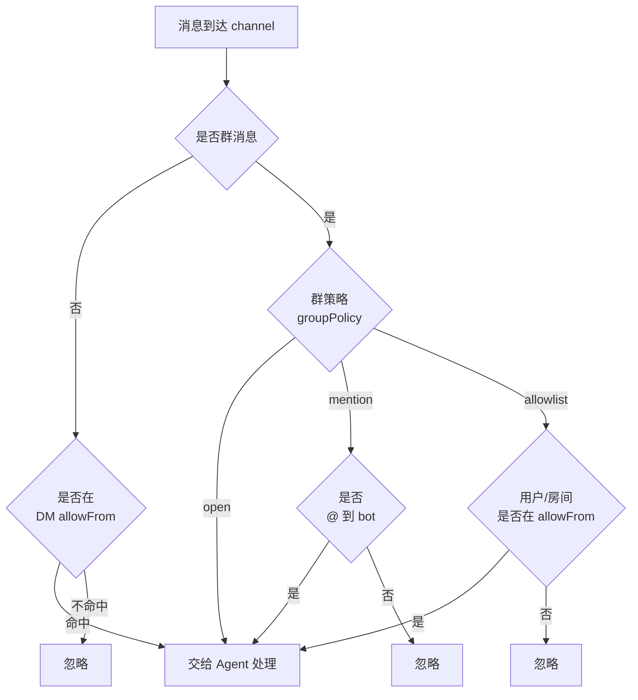

# Channel 配置（远程接入）

## 这一页解决什么

- 怎么让 Agent 在 Telegram / Slack / 飞书 / 钉钉 / 邮件 / Web 这些通道里被远程调用？
- 各 channel 怎么配（最小可用配置）？
- 怎么控制谁可以使唤 Agent（白名单 / 群组策略）？

## 全部内置 Channel

| Channel | key | 鉴权 | 群组策略 | 流式输出 |
| --- | --- | --- | --- | --- |
| 桌面/浏览器 UI | `ui` | 同源 + CORS 白名单 | — | ✅ |
| Telegram | `telegram` | Bot Token | `open` / `mention` | ✅ |
| WhatsApp | `whatsapp` | Bridge URL + Token | `open` / `mention` | — |
| Discord | `discord` | Bot Token（OAuth 流） | — | — |
| 飞书 Lark | `feishu` | App ID/Secret + 验证 token | `open` / `mention` | ✅ |
| 钉钉 | `dingtalk` | Client ID/Secret | — | — |
| Slack | `slack` | Bot/App Token | `open` / `mention` / `allowlist` | — |
| 微信社群（Mochat） | `mochat` | — | — | — |
| QQ | `qq` | App ID + Secret | — | — |
| Matrix | `matrix` | homeserver + 账号或 token | `open` / `mention` / `allowlist` | — |
| 邮件（IMAP+SMTP） | `email` | IMAP/SMTP 凭据 | — | — |
| WeCom（企微） | `wecom` | （插件化） | — | — |
| 微信公众号 | `weixin` | （插件化） | — | — |

## 全局开关

```json
{
  "channels": {
    "sendProgress": true,
    "sendToolHints": false,
    "sendMaxRetries": 3,
    "transcriptionProvider": "groq"
  }
}
```

| 字段 | 含义 |
| --- | --- |
| `sendProgress` | 是否把 Agent 文字进度流式推到 channel |
| `sendToolHints` | 是否把工具调用提示（`read_file("...")`）推过去（默认关，避免打扰） |
| `sendMaxRetries` | 投递失败重试次数（含首发） |
| `transcriptionProvider` | 语音转写后端：`groq` 或 `openai` |

## UI（桌面 / 浏览器，`channels.ui`）

`{{PROJECT_UI_NAME}}` 桌面应用和浏览器版前端连的就是这个 channel——通过 WebSocket 推消息、REST 拉项目数据。**不开它 UI 就连不上后端**，所以装完 mira 第一件事就是确认这一节配好。

```json
{
  "channels": {
    "ui": {
      "enabled": true,
      "allowFrom": ["*"],
      "corsOrigins": ["*"]
    }
  }
}
```

| 字段 | 默认 | 说明 |
| --- | --- | --- |
| `enabled` | `false` | 总开关。`mira onboard` 默认会写成 `true`；自己改 config 时别忘了开 |
| `allowFrom` | `[]` | 允许连接的客户端 ID / 来源白名单。`["*"]` 放行全部；空列表等同于"谁都不让连"，UI 会一直转圈 |
| `corsOrigins` | `["*"]` | CORS `Access-Control-Allow-Origin` 列表。`["*"]` 放行全部 origin（适合本机自用）；要锁死的话填 `["https://your-host"]` |

### Host / port 怎么定？

UI channel 不绑自己的端口——它**复用 gateway 监听的 host:port**（默认 `0.0.0.0:18790`）。所以你看到的 UI 连接地址其实就是 gateway 地址：

```bash
mira gateway                              # 0.0.0.0:18790
mira gateway --host 127.0.0.1 -p 28790    # 改 gateway，UI channel 跟着走
```

UI 连远程后端的话，`gateway` 必须监听 `0.0.0.0`（不能只 `127.0.0.1`），且对应端口的防火墙要开。详见 [troubleshooting §1](../../faq/troubleshooting.md#1-ui-无法连接后端)。

### 推荐配置

| 场景 | `allowFrom` | `corsOrigins` |
| --- | --- | --- |
| 个人本机 / 只跑桌面 app | `["*"]` | `["*"]` |
| 团队远程共享一台 mira（受信内网） | `["*"]` | `["https://mira.team.lan"]` |
| 公网暴露（不推荐，请优先走 Tailscale / VPN） | 具体 client ID 列表 | 具体 origin 列表 |

> 远程共享场景请先把 `tools.restrictToWorkspace` 保持 `true`，并且把鉴权放在 gateway 前面（反向代理 / Tailscale ACL），UI channel 本身不做用户级身份校验。

### 验收检查

```bash
# 后端起来
mira gateway -v

# 另开一个终端
curl http://127.0.0.1:18790/api/health     # 应返回 200
```

UI 客户端里把后端地址填成 `http://<host>:18790`，连接指示灯转绿就 OK。

## Telegram（最简单）

1. 找 [@BotFather](https://t.me/BotFather) 新建 bot，记下 token。
2. 写到 `~/.mira/config.json`：

```json
{
  "channels": {
    "telegram": {
      "enabled": true,
      "token": "1234567:ABC...",
      "groupPolicy": "mention",
      "reactEmoji": "👀",
      "streaming": true,
      "streamEditInterval": 0.6,
      "allowFrom": ["@your_username", "123456789"]
    }
  }
}
```

3. 启动：

```bash
mira gateway        # gateway 起来后 telegram 自动连
mira channels status
```

4. 在私聊里 `@bot 帮我查一下最新的 RSNA 综述`；群里 `@` 一下 bot。

`groupPolicy`：
- `open`：群里任何消息都响应（聊天群少用）。
- `mention`：必须 `@` bot 才响应（推荐）。

`allowFrom`：用户名（带 `@`）或 numeric user id 的白名单。空数组 = 不限制。

## 飞书

```json
{
  "channels": {
    "feishu": {
      "enabled": true,
      "appId": "cli_...",
      "appSecret": "...",
      "encryptKey": "...",
      "verificationToken": "...",
      "groupPolicy": "mention",
      "reactEmoji": "THUMBSUP",
      "streaming": true,
      "allowFrom": ["ou_xxx", "ou_yyy"]
    }
  }
}
```

需要在 [飞书开放平台](https://open.feishu.cn) 后台：
- 创建企业自建应用，记下 `appId` / `appSecret`。
- 启用机器人能力，订阅 `im.message.receive_v1`。
- 配置事件回调（指向你的 `mira gateway` 公网地址 `/feishu/events`）。
- 加密 key / 验证 token 在“事件订阅”页拷贝。

## Slack

```json
{
  "channels": {
    "slack": {
      "enabled": true,
      "botToken": "xoxb-...",
      "appToken": "xapp-...",
      "mode": "socket",
      "groupPolicy": "mention",
      "groupAllowFrom": ["C01234567"],
      "replyInThread": true,
      "dm": { "enabled": true, "policy": "open" }
    }
  }
}
```

`mode: "socket"` 模式下不需要公网回调，最适合先在工位上跑。后续公网部署时可换 events API。

## 邮件（适合后台跑长任务，让 Agent 把结果发回邮箱）

```json
{
  "channels": {
    "email": {
      "enabled": true,
      "consentGranted": true,
      "pollIntervalSeconds": 30,

      "imapHost": "imap.example.com",
      "imapPort": 993,
      "imapUsername": "agent@example.com",
      "imapPassword": "...",
      "imapUseSsl": true,
      "imapMailbox": "INBOX",

      "smtpHost": "smtp.example.com",
      "smtpPort": 587,
      "smtpUsername": "agent@example.com",
      "smtpPassword": "...",
      "smtpUseTls": true,

      "fromAddress": "agent@example.com",
      "subjectPrefix": "Re: ",
      "autoReplyEnabled": true,
      "maxBodyChars": 12000,
      "maxAttachmentSize": 10485760,
      "maxAttachmentsPerEmail": 5,
      "allowedAttachmentTypes": ["pdf", "csv", "png", "jpg"]
    }
  }
}
```

> `consentGranted: true` 是显式授权，避免误把 Mira 接到生产邮箱。

## Matrix（端到端加密的去中心化群聊）

```json
{
  "channels": {
    "matrix": {
      "enabled": true,
      "homeserver": "https://matrix.org",
      "userId": "@agent:matrix.org",
      "password": "...",
      "e2eeEnabled": true,
      "groupPolicy": "mention",
      "groupAllowFrom": ["!roomid:matrix.org"]
    }
  }
}
```

## 谁能使唤 Agent — 白名单层级



## 排障 checklist

- 配完没反应？先看 `mira channels status`，再看 `~/.mira/logs/agent-service.log` 中对应 channel 的报错。
- Telegram 收不到消息？多半是 `allowFrom` 没把你自己加进去。
- 飞书事件回调 401？检查 `verificationToken` 与 `encryptKey` 是否完全匹配。
- 长消息被截断？看 `channels.<name>.maxBodyChars`（邮件）或对应平台限制。

详见 [FAQ §7](../../faq/troubleshooting.md)。

## 验收检查

- [ ] `mira channels status` 显示对应 channel 为 `connected`。
- [ ] 在被允许的对话里说一句话，Agent 能在数秒内回复（不接 streaming 时为整段，接了 streaming 时为流式）。
- [ ] 切到不被允许的账号说话，Agent 不响应（不要把白名单测试当成 bug）。
