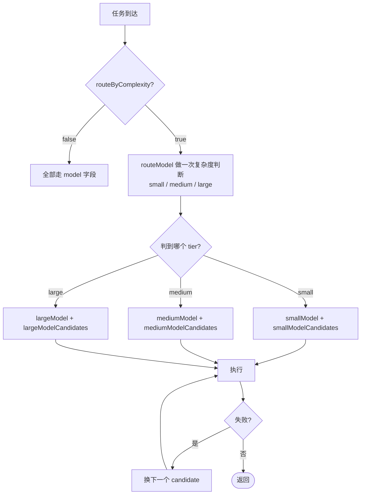

# 模型路由（Router）模式

## 这一页解决什么

- 同一个项目里，怎么让“小问题走便宜模型，大问题走旗舰模型”，但不写一行代码。
- `routeModel` / `smallModel` / `mediumModel` / `largeModel` 各自是干嘛的。
- 模型不可用时怎么自动 fallback。
- 怎么验证路由确实生效。

## 路由是怎么决定 tier 的



`routeModel` 是“裁判”，**只判 tier，不干活**。所以裁判应该 **快、稳、便宜**（如 `gpt-4o-mini`、`claude-haiku`、`deepseek-chat`）。

## 完整配置示例

```json
{
  "agents": {
    "defaults": {
      "provider": "openrouter",
      "model": "anthropic/claude-sonnet-4-5",

      "routeByComplexity": true,
      "routeModel": "openai/gpt-4o-mini",

      "smallModel":  "openai/gpt-4o-mini",
      "mediumModel": "anthropic/claude-sonnet-4-5",
      "largeModel":  "anthropic/claude-opus-4-5",

      "maxToolIterations": 80,
      "temperature": 0.1
    }
  },
  "providers": {
    "openrouter": { "apiKey": "sk-or-v1-..." }
  }
}
```

效果：

| 任务类型示例 | 路由结果 | 为什么 |
| --- | --- | --- |
| “把这个表格转成 markdown” | small | 纯格式化 |
| “跑 5 折交叉验证并出 ROC” | medium | 工程多步但有 skill 可套 |
| “给我一份完整的实验报告并审稿” | large | 长上下文 + 多次推理 |

## 候选列表（candidates）— 自动 fallback

任意 `*Model` 字段都可以接收一个 **数组**，数组里前面失败就走后面。例如某些时段 OpenRouter 限速、可以挂上备份：

```json
{
  "agents": {
    "defaults": {
      "smallModel": [
        "openai/gpt-4o-mini",
        "deepseek/deepseek-chat",
        "groq/llama-3.1-8b-instant"
      ]
    }
  }
}
```

> 第一个候选会被当成 `primary`；其余依次作为 fallback。`{{PROJECT_CORE_NAME}}` 在每一回合内重试时只会切到候选列表内的模型，不会乱跑。

## 不开路由的最佳实践

如果你只用一个 provider、一个 model，`routeByComplexity = false` 是更划算的：避免每回合多花一次 small-model 的复杂度判断 token。

```json
{ "agents": { "defaults": {
  "model": "anthropic/claude-opus-4-5",
  "routeByComplexity": false
}}}
```

## 何时该开路由

| 情况 | 建议 |
| --- | --- |
| 项目长期跑、token 成本敏感 | ✅ 开 |
| 单次实验、想要最稳输出 | ❌ 不开 |
| `largeModel` 是付费瓶颈、`smallModel` 是免费/本地 | ✅ 强烈推荐 |
| 团队共享一份 config、个人用量小 | 视情况 |

## 验证路由真的生效

启用路由后，跑一个混合任务：

```bash
mira agent --logs --verbose -m "先把这段 CSV 列出来，然后用 5 折交叉验证训一个分类器"
```

观察日志里是否出现：

```
[router] tier=small  model=openai/gpt-4o-mini   reason=trivial-formatting
[router] tier=large  model=anthropic/claude-opus-4-5  reason=multi-step-experiment
```

> 看不到 `[router]` tag？大概率是 `routeByComplexity` 没开，或者 `routeModel` 没配。

## 常见坑

- **`routeModel` 太聪明** — 用旗舰模型做裁判，等于白花钱。务必选小模型。
- **某 tier 没配** — 缺 `mediumModel` 时会 fallback 到 `model`，不是报错。检查 `mira status` 输出的 “effective tiers”。
- **provider 不一致** — `smallModel` 是 OpenAI、`largeModel` 是 Anthropic，需要两边 key 都有；否则失败时无可路由的 candidate。

## 验收检查

- [ ] `mira status` 显示路由开启 + 三个 tier 模型都已识别 provider。
- [ ] 跑一个简单 + 复杂混合任务时，日志能看到 tier 切换。
- [ ] 关掉某个 tier 的 key 后，能看到 fallback 到 candidate 列表里下一个模型而不是直接失败。
