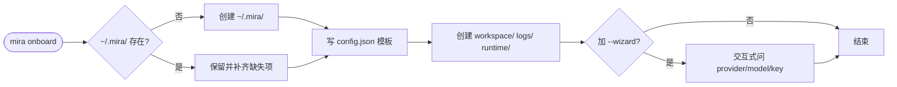

# onboard 与 workspace 初始化

## 这一页解决什么

- 第一次装完 `{{PROJECT_CORE_NAME}}`，`mira onboard` 到底做了哪些事？
- `~/.mira/` 里都有什么、各文件作用？
- 怎么换 workspace 位置？多人 / 多机器怎么搬？
- 从 `MedPilot` 升级时怎么自动迁移？

## `mira onboard` 实际做的事



它**不会**：联网、下载模型、动你已有的 `config.json` 中的 key。

## 工作区目录结构

```
~/.mira/
├── config.json                    # 主配置（模型、provider、tools、channels）
├── workspace/                     # ← Agent 唯一可写区
│   ├── PRJ-0001/
│   │   ├── task_plan.json         # 项目状态（UI 的真相源）
│   │   ├── data/                  # 原始/处理后数据
│   │   ├── experiments/           # 每个实验的脚本+输出
│   │   │   └── exp-001/
│   │   │       ├── run.py
│   │   │       ├── best_model.pt
│   │   │       └── metrics.json
│   │   └── result/
│   │       └── exports/           # 最终交付物
│   │           ├── experiment_report.md
│   │           └── presentation.pptx
│   └── PRJ-0002/...
├── logs/
│   ├── agent-service.log          # 引擎日志（轮转）
│   └── gateway.log
├── runtime/
│   └── diagnostics/               # mira-engine doctor --export 产物
└── .migrated-from-medpilot        # 自动迁移完成标记（只在曾迁移过的机器存在）
```

## 关键配置字段

打开 `~/.mira/config.json`，最少需要确认这几项：

```json
{
  "agents": {
    "defaults": {
      "workspace": "~/.mira/workspace",
      "provider": "auto",
      "model": "anthropic/claude-opus-4-5",
      "maxTokens": 8192,
      "temperature": 0.1,
      "maxToolIterations": 200,
      "timezone": "Asia/Shanghai"
    }
  },
  "providers": {
    "anthropic": { "apiKey": "sk-ant-..." }
  }
}
```

| 字段 | 别名（snake_case） | 默认 | 何时改 |
| --- | --- | --- | --- |
| `agents.defaults.workspace` | — | `~/.mira/workspace` | 想把数据放到大盘 / 共享盘 |
| `agents.defaults.provider` | — | `auto` | 想强制走某 provider，不靠 model 名匹配 |
| `agents.defaults.model` | — | `anthropic/claude-opus-4-5` | 切默认模型 |
| `agents.defaults.timezone` | — | `UTC` | dream/cron 调度按本地时区 |
| `agents.defaults.maxToolIterations` | `max_tool_iterations` | `200` | 长任务过早被掐断时上调 |
| `agents.defaults.contextWindowTokens` | `context_window_tokens` | `65536` | 模型支持窗口 < 64k 时下调 |
| `agents.defaults.unifiedSession` | `unified_session` | `false` | 一人多端共享会话 |

> 配置文件支持 **camelCase 与 snake_case 混用**（pydantic alias）。建议团队内统一用 camelCase。

## 换工作区位置

### 方案 A：改配置（推荐）

```json
{ "agents": { "defaults": { "workspace": "/data/mira/ws" } } }
```

然后：

```bash
mkdir -p /data/mira/ws
mira status        # 确认 workspace 已切换
```

### 方案 B：临时覆盖（一次性）

```bash
mira agent -w /tmp/scratch-ws -m "..."
mira gateway -w /data/mira/ws
```

### 方案 C：环境变量（部署时常用）

```bash
export MIRA_AGENTS__DEFAULTS__WORKSPACE="/data/mira/ws"
```

## 多机器迁移

把 `~/.mira/` 整个 rsync 过去就行：

```bash
rsync -av --delete ~/.mira/ user@host:~/.mira/
```

不要漏 `config.json`（含 key）和 `workspace/`（含项目）。`logs/` 和 `runtime/diagnostics/` 可以不带。

## 从 MedPilot 自动迁移

第一次执行任意 `mira ...` 子命令时，引擎会：

1. 检查 `~/.medpilot/` 是否存在且 `~/.mira/` 不存在。
2. 把 `~/.medpilot/` 重命名为 `~/.mira/`。
3. 在 `~/.mira/.migrated-from-medpilot` 写一个时间戳，避免重复迁移。
4. 把 `MEDPILOT_*` 环境变量在内存中映射为 `MIRA_*`（仅当 `MIRA_*` 未设置时）。

不需要任何手工动作。如果迁移没发生（例如两个目录都已存在），按 [FAQ §10](../../faq/troubleshooting) 手动处理。

## 验收检查

- [ ] `mira status` 全绿，`workspace` 路径符合预期。
- [ ] `~/.mira/workspace` 可读可写（`touch ~/.mira/workspace/.probe && rm $_`）。
- [ ] `{{PROJECT_UI_NAME}}` 能连上后端，能看到（哪怕是空的）项目列表。
- [ ] `~/.mira/logs/` 持续有新行写入（运行 `mira gateway` 后观察）。
