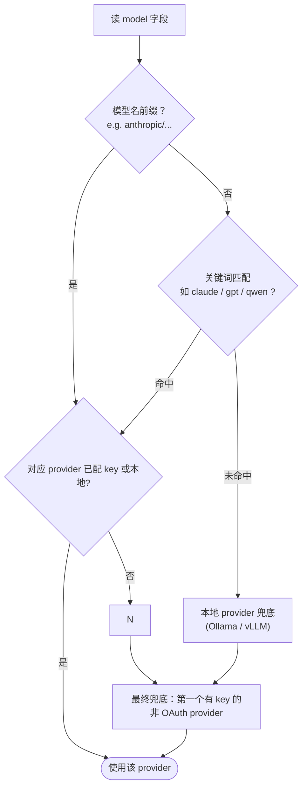

# Provider 与运行时参数

## 这一页解决什么

- `{{PROJECT_CORE_NAME}}` 现在支持哪些 LLM Provider？
- 怎么写最简的 provider 配置？
- `temperature` / `maxTokens` / `maxToolIterations` / `reasoningEffort` 各调到多少合适？
- `provider: "auto"` 是按什么规则匹配的？

## 内置 Provider 清单

| Provider key | 说明 | 鉴权方式 | 典型 model 字段 |
| --- | --- | --- | --- |
| `openai` | OpenAI 官方 | API key | `openai/gpt-4o`、`openai/gpt-4o-mini` |
| `anthropic` | Anthropic 官方 | API key | `anthropic/claude-opus-4-5`、`claude-sonnet-4-5` |
| `azureOpenai` | Azure OpenAI（model = deployment 名） | API key + `apiBase` | `azure_openai/<deployment>` |
| `openrouter` | OpenRouter 网关 | API key | `openrouter/anthropic/claude-3.7-sonnet` |
| `aihubmix` | AiHubMix 国际/国内网关 | API key + 可选 `extraHeaders` | `aihubmix/...` |
| `siliconflow` | SiliconFlow 硅基流动 | API key | `siliconflow/Qwen/Qwen2.5-72B-Instruct` |
| `volcengine` / `byteplus` | 火山引擎 / 国际版 | API key | `volcengine/doubao-...` |
| `deepseek` | DeepSeek 官方 | API key | `deepseek/deepseek-chat`、`deepseek-reasoner` |
| `dashscope` | 阿里 DashScope | API key | `dashscope/qwen-max` |
| `zhipu` | 智谱 GLM | API key | `zhipu/glm-4.5` |
| `moonshot` | 月之暗面 Kimi | API key | `moonshot/kimi-...` |
| `minimax` | MiniMax | API key | `minimax/...` |
| `mistral` | Mistral | API key | `mistral/mistral-large-latest` |
| `gemini` | Google Gemini | API key | `gemini/gemini-2.0-flash` |
| `groq` | Groq | API key | `groq/llama-3.1-70b-versatile` |
| `stepfun` | 阶跃星辰 | API key | `stepfun/...` |
| `xiaomiMimo` | 小米 MIMO | API key | `xiaomi_mimo/...` |
| `qianfan` | 百度千帆 | API key | `qianfan/...` |
| `ollama` | 本地 Ollama | 无（本地） | `ollama/qwen2.5:14b`、`llama3.2` |
| `vllm` | 本地 vLLM | 无（本地） | `vllm/<model>` |
| `ovms` | OpenVINO Model Server | 无（本地） | `ovms/<model>` |
| `custom` | 任意 OpenAI 兼容 endpoint | 自填 `apiKey` + `apiBase` | `custom/<whatever>` |
| `openaiCodex` | OpenAI Codex（OAuth） | OAuth 登录 | `openai_codex/...` |
| `githubCopilot` | GitHub Copilot（OAuth） | OAuth 登录 | `github_copilot/...` |

> OAuth provider（`openaiCodex`、`githubCopilot`）需要在 `mira onboard --wizard` 中走登录流程，不能直接写 key。

## 最常见的几种配置

### OpenAI 官方

```json
{
  "agents": { "defaults": { "provider": "openai", "model": "openai/gpt-4o" } },
  "providers": { "openai": { "apiKey": "sk-..." } }
}
```

### Anthropic 官方

```json
{
  "agents": { "defaults": { "provider": "anthropic", "model": "anthropic/claude-opus-4-5" } },
  "providers": { "anthropic": { "apiKey": "sk-ant-..." } }
}
```

### OpenRouter（一把钥匙调全家）

```json
{
  "agents": { "defaults": {
    "provider": "openrouter",
    "model": "anthropic/claude-sonnet-4-5"
  }},
  "providers": { "openrouter": { "apiKey": "sk-or-v1-..." } }
}
```

> 用 OpenRouter 时 `model` 既可以写 `anthropic/claude-sonnet-4-5`（简短），也可以写 `openrouter/anthropic/claude-sonnet-4-5`（带前缀）。

### Azure OpenAI（注意 model = deployment 名）

```json
{
  "agents": { "defaults": {
    "provider": "azureOpenai",
    "model": "azure_openai/my-gpt-4o-deployment"
  }},
  "providers": {
    "azureOpenai": {
      "apiKey": "<azure-key>",
      "apiBase": "https://my-resource.openai.azure.com",
      "extraHeaders": { "api-version": "2024-08-01-preview" }
    }
  }
}
```

### 任意 OpenAI 兼容 endpoint（`custom`）

```json
{
  "agents": { "defaults": { "provider": "custom", "model": "custom/qwen2.5-72b" } },
  "providers": {
    "custom": {
      "apiKey": "<key>",
      "apiBase": "https://my-gateway.example.com/v1",
      "extraHeaders": { "X-Tenant": "lab-skmr" }
    }
  }
}
```

### 本地 Ollama

```json
{
  "agents": { "defaults": { "provider": "ollama", "model": "qwen2.5:14b" } },
  "providers": { "ollama": { "apiBase": "http://localhost:11434" } }
}
```

### 本地 vLLM

```json
{
  "agents": { "defaults": { "provider": "vllm", "model": "vllm/Qwen/Qwen2.5-32B-Instruct" } },
  "providers": { "vllm": { "apiBase": "http://localhost:8000/v1" } }
}
```

### OAuth：OpenAI Codex / GitHub Copilot

```bash
mira onboard --wizard
# → 选 openai-codex 或 github-copilot → 浏览器登录
```

不要在 config.json 里写 key——`openaiCodex` / `githubCopilot` 字段会被显式 `exclude=True` 忽略，token 由专用流程托管。

## `provider: "auto"` 的匹配规则



实战建议：**只要不是 100% 依赖关键词推断，建议显式写 `provider`，避免被自动匹配带偏。**

## 运行时参数怎么调

| 字段 | 默认 | 调高的代价 | 调低的代价 |
| --- | --- | --- | --- |
| `maxTokens` | `8192` | 单回合更慢、更贵 | 输出可能被截断 |
| `temperature` | `0.1` | 输出更跳 | 输出更死板 |
| `maxToolIterations` | `200` | 长任务有保障，但失控时烧钱 | 长任务可能被掐断 |
| `maxToolResultChars` | `16000` | 上下文吃紧 | 工具输出被截断 |
| `contextWindowTokens` | `65536` | 模型窗口够才有意义 | 早早触发上下文压缩 |
| `reasoningEffort` | `null` | 启用思维链；更贵更慢更准 | 关掉则全速但不深思 |
| `providerRetryMode` | `standard` | `persistent` 死磕同一 provider | `standard` 更早 fallback |

研究/工程任务的常用基线：

```json
{ "agents": { "defaults": {
  "temperature": 0.1,
  "maxTokens": 8192,
  "maxToolIterations": 80,
  "maxToolResultChars": 16000,
  "contextWindowTokens": 128000,
  "reasoningEffort": null,
  "providerRetryMode": "standard"
}}}
```

`reasoningEffort` 取值：`"low"` / `"medium"` / `"high"` / `"adaptive"` / `null`。仅对支持思维链的模型（Claude `extended thinking`、OpenAI o-series 等）有效。

## 用环境变量覆盖（适合 CI / Docker）

任何字段都能用 `MIRA_*` 环境变量覆盖，嵌套字段用 `__`：

```bash
export MIRA_AGENTS__DEFAULTS__MODEL="openai/gpt-4o"
export MIRA_AGENTS__DEFAULTS__TEMPERATURE=0.0
export MIRA_PROVIDERS__OPENAI__API_KEY="sk-..."
export MIRA_PROVIDERS__OPENROUTER__API_KEY="sk-or-..."
```

## 验收检查

- [ ] `mira status` 显示 provider 已识别 + key 已加载（key 仅显示前缀）。
- [ ] `mira agent -m "ping"` 能在 5 秒内拿到回复。
- [ ] 切换 provider 后无残留 401/403。
- [ ] 本地 provider（Ollama/vLLM）配置后 `apiBase` 可达：`curl $apiBase/models` 能返回列表。
