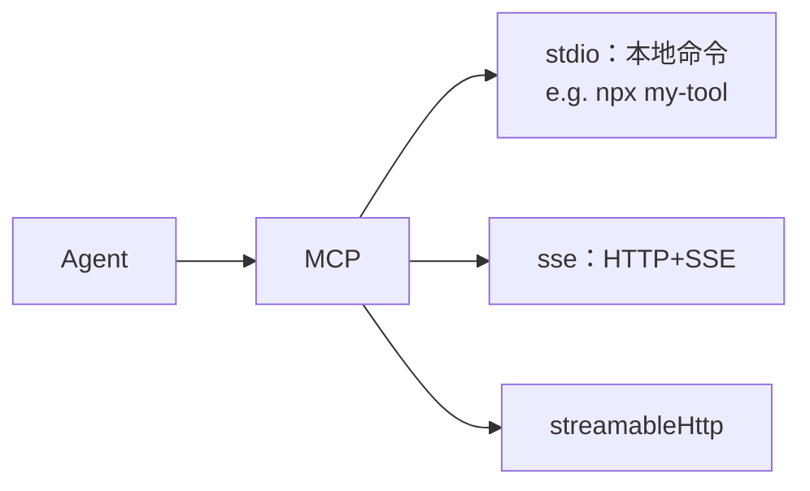

# Skills 与 Tools

## 这一页解决什么

- `{{PROJECT_CORE_NAME}}` 内置了哪些 skill？哪些可以直接拿来用？
- Skill 与 Tool 的边界在哪？
- 怎么限制 / 放开 Agent 能用的工具？
- 怎么挂一个自定义的 MCP server？

## Skill vs Tool — 一句话区分

- **Tool** = “**能做**什么”：写文件、执行 shell、发 HTTP 请求、调 MCP server。粒度细，原子。
- **Skill** = “**怎么做**一件事”：一段写好的 SOP（Markdown + 可选脚本），告诉 Agent “要做 X，按以下步骤、用以下工具、产出以下文件”。粒度粗，可复用。

> 你可以理解为：Tools 是手脚，Skills 是肌肉记忆。

## 内置 Skill 目录

| 分类 | Skills | 用途要点 |
| --- | --- | --- |
| `medical-imaging/` | `medical-image-dl-pipeline` | 端到端 DL：分类/分割/检测，5 折 CV，early stopping |
| | `radiomics`、`pyradiomics` | 影像组学特征提取 + LASSO/mRMR 选特征 |
| | `monai`、`nibabel`、`pydicom` | 框架包装与常用代码片段 |
| | `dicom2nifti` | DICOM → NIfTI 转换 |
| | `medical-imaging-review` | 影像方法学审稿清单 |
| `ml-statistics/` | `survival-analysis` | KM 曲线、Cox PH、lifelines |
| | `scikit-survival` | 高维生存分析 |
| | `scikit-learn` | 经典 ML 工程模板 |
| | `statistical-analysis` | 假设检验、效应量、置信区间 |
| `research/` | `deep-research` | 多源调研 + 证据汇总 |
| | `pubmed-search` | PubMed 检索（自动构造布尔表达式） |
| | `multi-search-engine` | 多搜索引擎并发 + 去重 |
| | `peer-review` | 模拟审稿、给修改建议 |
| | `scientific-method` | 科研问题/假设/方法/结论模板 |
| | `agent-browser` | 通用浏览器自动化 |
| | `find-skills` | 在你 workspace 里搜可用 skill |
| `visualization/` | `matplotlib`、`seaborn` | 出图常用 |
| | `scientific-slides` | 学术 PPT |
| | `scientific-schematics` | 流程图 / 示意图 |
| | `scientific-visualization` | 综合可视化 |
| `engineering/` | （多个） | 通用代码任务模板 |
| `documents/` | （多个） | 文档处理（解析、转换） |
| `cron/` | （多个） | 周期任务 |
| `summarize/` | （多个） | 长文 / 多文档摘要 |
| `tmux/` | （多个） | 长进程 / 后台命令托管 |
| `clawhub/` | （多个） | 实验追踪/调度脚手架 |
| `weather/` | （多个） | 示例 skill，可参考做新 skill |
| `github/` | （多个） | 仓库操作 / PR / Issue |
| `memory/` | （多个） | 长期记忆管理 |
| `skill-creator/` | `skill-creator` | **生成新 skill** 的模板/校验脚本 |

> Skills 都是普通文件夹，路径在 `mira_engine/skills/<分类>/<skill-name>/SKILL.md`。Agent 通过 `find-skills` 自动检索。
> 想加自己的 skill？放到 `~/.mira/workspace/skills/<your-skill>/SKILL.md`，Agent 同样能发现它。

## Tool 清单

| Tool | 配置入口 | 是否默认开 | 说明 |
| --- | --- | --- | --- |
| `filesystem` | 内置 | ✅ | `read_file` / `write_file` / `list_dir` 等，**强制限制在 workspace** |
| `exec`（shell） | `tools.exec` | ✅ | 子进程执行，带 `timeout`、`pathAppend`、可选 `bwrap` 沙箱 |
| `web` | `tools.web` | ✅ | 抓页面、查搜索引擎 |
| `web.search` | `tools.web.search` | ✅ | 搜索后端：`duckduckgo` / `brave` / `tavily` / `searxng` / `jina` |
| `mcp_<server>_<tool>` | `tools.mcpServers` | 视配置 | 任意 Model Context Protocol server 暴露的工具 |

最小工具配置：

```json
{
  "tools": {
    "restrictToWorkspace": true,
    "exec":  { "enable": true, "timeout": 60, "pathAppend": "" },
    "web": {
      "enable": true,
      "search": { "provider": "duckduckgo", "maxResults": 5, "timeout": 30 }
    }
  }
}
```

> `restrictToWorkspace: true` 强烈建议**始终保持开启**，会限制所有工具的访问范围在 workspace 内。

## Web 搜索 provider

| Provider | 备注 |
| --- | --- |
| `duckduckgo` | 默认，无需 key |
| `brave` | 需 `apiKey`；质量最稳 |
| `tavily` | 需 `apiKey`；适合学术 |
| `searxng` | 自托管 SearXNG 实例，需 `baseUrl` |
| `jina` | 需 `apiKey` |

```json
{ "tools": { "web": { "search": {
  "provider": "brave",
  "apiKey": "BSAxxxxxxxx",
  "maxResults": 8,
  "timeout": 30
}}}}
```

## 让 Agent 走代理（公司网/校园网）

```json
{ "tools": { "web": {
  "proxy": "http://127.0.0.1:7890"
}}}
```

也支持 `socks5://127.0.0.1:1080`。

## SSRF 白名单（Tailscale / 内网）

如果你需要让 Agent 访问内网或 Tailscale，把对应 CIDR 加到 SSRF 白名单：

```json
{ "tools": {
  "ssrfWhitelist": ["100.64.0.0/10", "10.0.0.0/8"]
}}
```

## 挂载自定义 MCP server



`tools.mcpServers` 支持 stdio / SSE / streamable-HTTP 三种类型，`type` 留空时根据 `command` / `url` 字段自动推断：

```json
{
  "tools": {
    "mcpServers": {
      "filesystem-extra": {
        "command": "npx",
        "args": ["-y", "@modelcontextprotocol/server-filesystem", "/data/share"],
        "env": { "READONLY": "1" },
        "toolTimeout": 30,
        "enabledTools": ["*"]
      },
      "team-knowledge": {
        "url": "https://mcp.team.example.com/sse",
        "headers": { "Authorization": "Bearer <token>" },
        "enabledTools": ["search_kb", "fetch_doc"]
      }
    }
  }
}
```

每个 MCP server 暴露的 tool 会被以 `mcp_<server>_<tool>` 名字注册到 Agent 工具栈。`enabledTools` 用来：

- `["*"]`：开放该 server 下所有工具（默认）。
- `["search_kb", "fetch_doc"]`：白名单，只暴露这两个。
- `[]`：完全屏蔽该 server 的工具（但仍维持连接）。

## 验收检查

- [ ] `mira agent --verbose -m "查一下最近 SAM 在医学影像的应用"` 能看到 `web.search` 与 `read_file` 等工具调用 hint。
- [ ] 把 `tools.exec.enable` 设 `false` 后再跑同一任务，Agent 应自然回退、不再调用 shell。
- [ ] 配好 MCP server 后，`mira status` 显示 `mcp_<server>_<tool>` 已注册。
