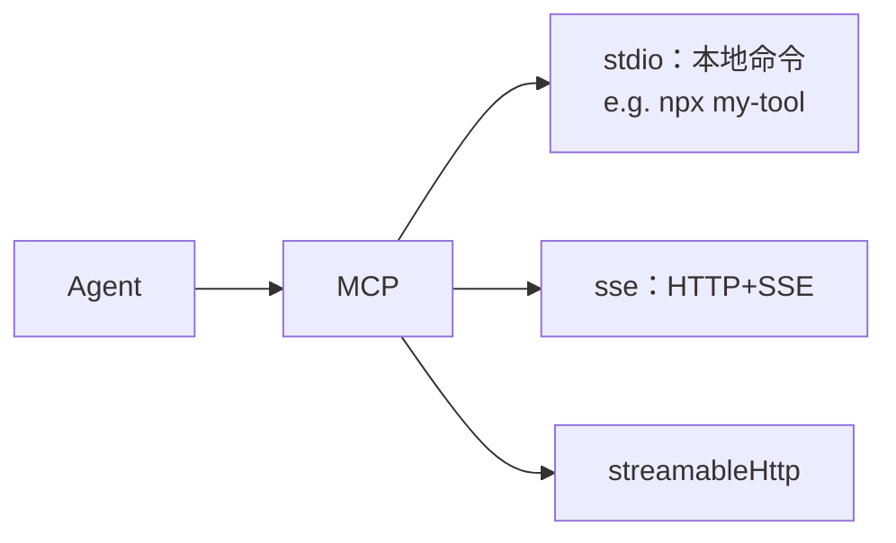

# Skills 与 Tools

## 这一页解决什么

- `{{PROJECT_CORE_NAME}}` 内置了哪些 skill？哪些可以直接拿来用？
- Skill 与 Tool 的边界在哪？
- 怎么限制 / 放开 Agent 能用的工具？
- 怎么挂一个自定义的 MCP server？

## Skill vs Tool — 一句话区分

- **Tool** = “**能做**什么”：写文件、执行 shell、发 HTTP 请求、调 MCP server。粒度细，原子。
- **Skill** = “**怎么做**一件事”：一段写好的 SOP（Markdown + 可选脚本），告诉 Agent “要做 X，按以下步骤、用以下工具、产出以下文件”。粒度粗，可复用。

> 你可以理解为：Tools 是手脚，Skills 是肌肉记忆。

## 内置 Skill 目录

| 分类 | Skills | 用途要点 |
| --- | --- | --- |
| `medical-imaging/` | `medical-image-dl-pipeline` | 端到端 DL：分类/分割/检测，5 折 CV，early stopping |
| | `radiomics`、`pyradiomics` | 影像组学特征提取 + LASSO/mRMR 选特征 |
| | `monai`、`nibabel`、`pydicom` | 框架包装与常用代码片段 |
| | `dicom2nifti` | DICOM → NIfTI 转换 |
| | `medical-imaging-review` | 影像方法学审稿清单 |
| `ml-statistics/` | `survival-analysis` | KM 曲线、Cox PH、lifelines |
| | `scikit-survival` | 高维生存分析 |
| | `scikit-learn` | 经典 ML 工程模板 |
| | `statistical-analysis` | 假设检验、效应量、置信区间 |
| `research/` | `deep-research` | 多源调研 + 证据汇总 |
| | `pubmed-search` | PubMed 检索（自动构造布尔表达式） |
| | `multi-search-engine` | 多搜索引擎并发 + 去重 |
| | `peer-review` | 模拟审稿、给修改建议 |
| | `scientific-method` | 科研问题/假设/方法/结论模板 |
| | `agent-browser` | 通用浏览器自动化 |
| | `find-skills` | 在你 workspace 里搜可用 skill |
| `visualization/` | `matplotlib`、`seaborn` | 出图常用 |
| | `scientific-slides` | 学术 PPT |
| | `scientific-schematics` | 流程图 / 示意图 |
| | `scientific-visualization` | 综合可视化 |
| `engineering/` | （多个） | 通用代码任务模板 |
| `documents/` | （多个） | 文档处理（解析、转换） |
| `cron/` | （多个） | 周期任务 |
| `summarize/` | （多个） | 长文 / 多文档摘要 |
| `tmux/` | （多个） | 长进程 / 后台命令托管 |
| `clawhub/` | （多个） | 实验追踪/调度脚手架 |
| `weather/` | （多个） | 示例 skill，可参考做新 skill |
| `github/` | （多个） | 仓库操作 / PR / Issue |
| `memory/` | （多个） | 长期记忆管理 |
| `skill-creator/` | `skill-creator` | **生成新 skill** 的模板/校验脚本 |

> Skills 都是普通文件夹，路径在 `mira_engine/skills/<分类>/<skill-name>/SKILL.md`。Agent 通过 `find-skills` 自动检索。
> 想加自己的 skill？放到 `~/.mira/workspace/skills/<your-skill>/SKILL.md`，Agent 同样能发现它。

## Tool 清单

| Tool | 配置入口 | 是否默认开 | 说明 |
| --- | --- | --- | --- |
| `filesystem` | 内置 | ✅ | `read_file` / `write_file` / `list_dir` 等，**强制限制在 workspace** |
| `exec`（shell） | `tools.exec` | ✅ | 子进程执行，带 `timeout`、`pathAppend`、可选 `bwrap` 沙箱、可选 `background=true` |
| `bg` | 主 loop 自动注册 | ✅（仅主 loop） | 列出 / 监控 / 终止后台任务，配合 `exec(background=true)` 用 |
| `web` | `tools.web` | ✅ | 抓页面、查搜索引擎 |
| `web.search` | `tools.web.search` | ✅ | 搜索后端：`duckduckgo` / `brave` / `tavily` / `searxng` / `jina` |
| `mcp_<server>_<tool>` | `tools.mcpServers` | 视配置 | 任意 Model Context Protocol server 暴露的工具 |

最小工具配置：

```json
{
  "tools": {
    "restrictToWorkspace": true,
    "exec":  { "enable": true, "timeout": 60, "pathAppend": "" },
    "web": {
      "enable": true,
      "search": { "provider": "duckduckgo", "maxResults": 5, "timeout": 30 }
    }
  }
}
```

> `restrictToWorkspace: true` 强烈建议**始终保持开启**，会限制所有工具的访问范围在 workspace 内。

## 项目级 Python venv 隔离（`tools.exec.python`）

> 这是一个**默认关闭、需要显式开启**的特性。打开后，每个 `PRJ-xxxx/` 下都会有一个独立的 `.venv/`，agent 跑 `python` / `pip` / `pytest` 时自动用项目自己的解释器，不再污染系统 / 全局环境。

### 为什么需要它

不开启时，`exec` 工具直接调用父进程 PATH 上的 `python`，多个项目共用同一个全局 site-packages：

- A 项目装了 `torch==2.1`，B 项目要 `torch==2.4`，互相覆盖；
- agent 误装的依赖会留在系统环境里，没办法干净回滚；
- 想换 Python 版本得改 shell rc。

开启后，第一次在某个项目里跑 python 类命令，`exec` 工具会：

1. 在项目目录建 `.venv/`（用 [uv](https://docs.astral.sh/uv/)，速度比 `python -m venv` 快很多）；
2. 检测项目根的 `pyproject.toml` / `requirements.txt` / `uv.lock`，有就 `uv sync` / `uv pip install -r ...`；都没有就建空 venv，让 agent 按需 `pip install`；
3. 给该项目所有后续子进程把 `<project>/.venv/bin` 注入到 PATH 最前面。

第二次起同一项目就直接复用，不会重复 bootstrap。

### 前置条件

- 本机 PATH 上要有 `uv >= 0.5.0`（`brew install uv` / `pip install uv` / `curl -LsSf https://astral.sh/uv/install.sh | sh`）。`{{PROJECT_CORE_NAME}}` 桌面 bundle 自带 `uv`，源码安装需要自己装。
- 没装 `uv` 而 `manager` 又被设成 `"uv"`，第一次触发时会抛 `PythonEnvError`，agent 的 shell 调用会失败。

### 配置

编辑 `~/.mira/config.json`：

```json
{
  "tools": {
    "exec": {
      "python": {
        "manager": "uv",
        "autoBootstrap": true,
        "venvDir": ".venv",
        "pythonVersion": "3.11",
        "linkMode": "hardlink",
        "cacheDir": "",
        "baselineRequirements": [],
        "rewritePipInstall": false
      }
    }
  }
}
```

字段含义：

| 字段 | 默认 | 说明 |
| --- | --- | --- |
| `manager` | `"off"` | `"off"` 维持旧行为；`"uv"` 启用本特性；`"system"` 为预留模式（passthrough，仅 pin 解释器、不建 venv），**当前版本尚未实现**，写了等同 `"off"` |
| `autoBootstrap` | `true` | 第一次遇到 `python` / `pip` / `pytest` / `jupyter` / `ipython` / `uv` 命令时自动建 venv；关掉就只在你手动 `mira runtime ...` 时才建 |
| `venvDir` | `".venv"` | 项目相对路径；可以写绝对路径把所有 venv 集中到外部目录 |
| `pythonVersion` | `""` | `""` 让 uv 自动选；写 `"3.11"` / `"3.12.4"` 等；首次需要的版本 uv 会自动下载（standalone build） |
| `linkMode` | `"hardlink"` | `hardlink` 最省盘；`clone` 走 APFS / btrfs reflink；`symlink` / `copy` 是兜底 |
| `cacheDir` | `""` | 覆盖 `$UV_CACHE_DIR`；多用户机器或想集中管理时用 |
| `baselineRequirements` | `[]` | 项目里既没 `pyproject.toml` 也没 `requirements.txt` 时，bootstrap 完往 venv 里默认装的包，例如 `["numpy", "pandas"]` |
| `rewritePipInstall` | `false` | `true` 时 `exec` 会把 agent 发的 `pip install ...` / `python -m pip install ...` 改写成 `uv pip install ...`；`pip list` / `pip show` 等只读子命令永远不改写 |

### 验证

```bash
mira runtime info
# Manager: uv
# Auto-bootstrap: True
# Venv dir: .venv
# Pinned python: 3.11
# uv: /opt/homebrew/bin/uv (v0.5.11)

# 跑一次 agent 触发 bootstrap
mira agent -m "在 PRJ-0019 里跑 python -c 'import sys; print(sys.executable)'"

# 应能看到
ls ~/.mira/workspace/PRJ-0019/.venv/bin/python
```

相关 CLI（`mira runtime info` / `cache-prune` / `project-gc` / `install-python`）见 [CLI 命令参考](../../cli-reference.md#mira-runtime)。

## 后台长任务（`exec(background=true)` + `bg` 工具）

`exec` 默认是**前台**调用，命令打包等结果，受 `tools.exec.timeout` 上限约束（最大 600s）。神经网络训练、大数据预处理、长仿真这种 30 分钟以上的活儿，前台模式扛不住。

从 v0.3.0 起 `exec` 支持 `background=true`，配合新增的 `bg` 工具实现真正的**后台任务托管**：

- agent 在主 loop 里调 `exec(command="...", background=true, description="...")`：fork 一个 detached 子进程，立刻返回 `{job_id, pid}`，不再受前台 timeout 约束；
- stdout / stderr 实时落到 `<workspace>/.mira/jobs/<job_id>/{stdout.log, stderr.log}`；
- agent 后续通过 `bg` 工具跨多个 loop 轮次轮询 / tail / wait / kill 这个 job，不会一直阻塞在单次 tool call 上。

### 哪些 loop 启用了 `bg`

- **主 loop**（`mira agent` / `mira research` / gateway / `serve`）：默认 `enable_background=True`，注册 `BackgroundJobRegistry` + 暴露 `bg` 工具。
- **Subagent**（agent 派出去的子 loop）：故意保持 `enable_background=False`——子上下文里没有 `bg` 工具能监控这些 job，不应该让它们 fire-and-forget。

引擎关闭时 registry 会被 drain，所有还活着的子进程会被 best-effort SIGTERM → SIGKILL，避免孤儿进程。

### `exec(background=true)` 参数

启用后台模式后，`exec` 工具 schema 多出两个字段：

| 字段 | 类型 | 说明 |
| --- | --- | --- |
| `background` | bool | 默认 `false`。`true` 时启动 detached 任务并立即返回 |
| `description` | string | 可选。给 job 起个人类可读名字，会出现在 `bg list` 里。`background=false` 时忽略 |

### `bg` 工具 actions

```text
action 枚举: list | status | tail | wait | kill
```

| Action | 必需参数 | 行为 |
| --- | --- | --- |
| `list` | — | 列出当前 registry 里所有 job：状态（running / exited）、`job_id`、`pid`、`description`、started_at |
| `status` | `job_id` | 单 job 详情：cwd、command 预览、`exit_code`（若已退出）、`exited_at` |
| `tail` | `job_id` | 取 stdout/stderr 最后 N 行；`tail_lines` 默认 40，最大 1000 |
| `wait` | `job_id` | 阻塞最多 `timeout` 秒（默认 30，最大 600）等待退出。超时会返回 "still running" 让 agent 下一轮再查 |
| `kill` | `job_id` | SIGTERM → 5s 宽限期 → SIGKILL。POSIX 上整个进程组一起杀（spawn 时设了 `start_new_session=True`） |

### 用户视角

绝大多数情况你**不用手动配置**——agent 看到长任务自己会切到 `background=true`。需要你介入的场景：

- **直接看进度**：去 `<workspace>/.mira/jobs/<job_id>/` 看实时日志；旧 job 目录会在新一次主 loop 启动时自动清理。
- **手动杀 job**：如果引擎挂了导致 registry 丢失，按 `pid` 直接 `kill -TERM <pid>`；或重启 mira 后 registry 会从空开始（**job 不持久化跨重启**）。
- **不希望某个 agent 走后台**：subagent 自动就不能用，主 loop 想关掉的话目前没有 config 开关，要改代码 `ExecTool(enable_background=False)`。

## Web 搜索 provider

| Provider | 备注 |
| --- | --- |
| `duckduckgo` | 默认，无需 key |
| `brave` | 需 `apiKey`；质量最稳 |
| `tavily` | 需 `apiKey`；适合学术 |
| `searxng` | 自托管 SearXNG 实例，需 `baseUrl` |
| `jina` | 需 `apiKey` |

```json
{ "tools": { "web": { "search": {
  "provider": "brave",
  "apiKey": "BSAxxxxxxxx",
  "maxResults": 8,
  "timeout": 30
}}}}
```

## 让 Agent 走代理（公司网/校园网）

```json
{ "tools": { "web": {
  "proxy": "http://127.0.0.1:7890"
}}}
```

也支持 `socks5://127.0.0.1:1080`。

## SSRF 白名单（Tailscale / 内网）

如果你需要让 Agent 访问内网或 Tailscale，把对应 CIDR 加到 SSRF 白名单：

```json
{ "tools": {
  "ssrfWhitelist": ["100.64.0.0/10", "10.0.0.0/8"]
}}
```

## 挂载自定义 MCP server



`tools.mcpServers` 支持 stdio / SSE / streamable-HTTP 三种类型，`type` 留空时根据 `command` / `url` 字段自动推断：

```json
{
  "tools": {
    "mcpServers": {
      "filesystem-extra": {
        "command": "npx",
        "args": ["-y", "@modelcontextprotocol/server-filesystem", "/data/share"],
        "env": { "READONLY": "1" },
        "toolTimeout": 30,
        "enabledTools": ["*"]
      },
      "team-knowledge": {
        "url": "https://mcp.team.example.com/sse",
        "headers": { "Authorization": "Bearer <token>" },
        "enabledTools": ["search_kb", "fetch_doc"]
      }
    }
  }
}
```

每个 MCP server 暴露的 tool 会被以 `mcp_<server>_<tool>` 名字注册到 Agent 工具栈。`enabledTools` 用来：

- `["*"]`：开放该 server 下所有工具（默认）。
- `["search_kb", "fetch_doc"]`：白名单，只暴露这两个。
- `[]`：完全屏蔽该 server 的工具（但仍维持连接）。

## 验收检查

- [ ] `mira agent --verbose -m "查一下最近 SAM 在医学影像的应用"` 能看到 `web.search` 与 `read_file` 等工具调用 hint。
- [ ] 把 `tools.exec.enable` 设 `false` 后再跑同一任务，Agent 应自然回退、不再调用 shell。
- [ ] 配好 MCP server 后，`mira status` 显示 `mcp_<server>_<tool>` 已注册。
