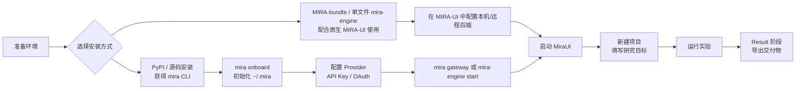

import Tabs from '@theme/Tabs';
import TabItem from '@theme/TabItem';

# 快速开始（10 分钟）

本节带你从“一台干净的电脑”到“在 UI 里看到第一个项目跑出结果”。全程约 10 分钟（不含模型调用本身的时间）。

> 先记一个最重要的选择题：
> - 想在**同一台电脑**上把 UI 和本地 `mira-engine` 一起装好，首启自动拉起本机引擎：选 `MIRA-bundle`
> - 想连接**远程服务器上的 mira**，或你已经自己装好了本机 `mira` / `mira-engine`：选 `MIRA-standalone`



---

## 0) 前置条件

最少需要：

- 一台 macOS / Windows / Linux 电脑。
- 至少 **一个** 模型 Provider 的 API key（OpenAI / Anthropic / OpenRouter / DeepSeek / 阿里 DashScope / 智谱 / 火山 / Azure 等任一即可），也可以用本地的 Ollama（不要 key）。

按你后面选的安装方式不同，软件依赖不同：

| 安装方式 | Python | Node.js | Git |
| --- | --- | --- | --- |
| **A. 单文件可执行**（推荐搭配原生 MIRA-UI） | ❌ 不需要 | 仅在你想从源码跑 UI 时需要 | ❌ |
| **B. PyPI 安装**（推荐熟悉 Python 的研究者） | 3.11 或 3.12 | 仅在你想从源码跑 UI 时需要 | ❌ |
| **C. 源码安装**（开发者 / 想 hack） | 3.11 或 3.12 | 20+ | ✅ |

> 不知道 Provider 选哪个？想要省事且效果稳：注册一个 [OpenRouter](https://openrouter.ai) key，能用一把钥匙调遍主流闭源/开源模型。

## 1) 安装 `{{PROJECT_CORE_NAME}}` 引擎

挑一个你最舒服的方式。**装一种就够了**，不要混装。

<Tabs groupId="install-method">
  <TabItem value="binary" label="A. 单文件可执行（配合 MIRA-UI）" default>

无需 Python，下载即用，适合非开发者，但它**必须搭配其他客户端使用**，推荐搭配原生 `MIRA-UI`（尤其是 `MIRA-bundle`）使用。

> 重要：单文件 `mira-engine` 只提供本地引擎服务管理 CLI，用来注册、启动、停止、诊断 gateway 后台服务。它**不是**完整的 `mira` 用户 CLI，不包含 `mira onboard`、`mira agent`、`mira gateway` 等命令。
>
> 如果你需要在终端执行 `mira onboard` 初始化，或直接用 `mira agent ...` 对话，请改用 B. PyPI 安装或 C. 源码安装。

到 [GitHub Releases](https://github.com/{{PROJECT_ORG_NAME}}/mira/releases/latest) 下载对应平台的可执行文件（每个文件都附带 `.sha256` 校验和）：

| 平台 | 文件 |
| --- | --- |
| Windows (x86_64) | `mira-engine-windows-x86_64.exe` |
| macOS (Apple Silicon) | `mira-engine-macos-arm64` |
| macOS (Intel) | `mira-engine-macos-x86_64` |
| Linux (x86_64) | `mira-engine-linux-x86_64` |

放到 `PATH` 里即可（建议改名去掉平台后缀）。

**macOS / Linux：**

```bash
# 以 macOS arm64 为例
curl -L -o mira-engine \
  https://github.com/{{PROJECT_ORG_NAME}}/mira/releases/latest/download/mira-engine-macos-arm64
chmod +x mira-engine
sudo mv mira-engine /usr/local/bin/

# macOS 首次运行可能需要解除 Gatekeeper 隔离
xattr -dr com.apple.quarantine /usr/local/bin/mira-engine
```

**Windows（PowerShell，管理员）：**

```powershell
# 下载到固定目录并加入 PATH
$dst = "C:\Program Files\Mira"
New-Item -ItemType Directory -Force -Path $dst | Out-Null
Invoke-WebRequest -Uri "https://github.com/{{PROJECT_ORG_NAME}}/mira/releases/latest/download/mira-engine-windows-x86_64.exe" `
  -OutFile "$dst\mira-engine.exe"
[Environment]::SetEnvironmentVariable("Path", $env:Path + ";$dst", "Machine")
```

单文件版可用的日常命令是：

```bash
mira-engine doctor
mira-engine install-service --host 127.0.0.1 --port 18790
mira-engine start
mira-engine status
mira-engine logs
mira-engine stop
```

这些命令只能管理本机 gateway 服务；首次配置 Provider / OAuth / workspace 时，请使用原生 `MIRA-UI` 的引导，或先通过 B / C 安装方式运行 `mira onboard --wizard`。

校验：

```bash
mira-engine --help
mira-engine doctor
```

  </TabItem>
  <TabItem value="pypi" label="B. PyPI 安装">

适合已经有 Python 3.11/3.12 环境的研究者和 CI。

```bash
# 推荐用 venv / conda 隔离
python -m venv ~/.venvs/mira
source ~/.venvs/mira/bin/activate    # Windows: ~\.venvs\mira\Scripts\activate

pip install mira-engine
```

校验：

```bash
mira --version
mira --help
```

应该能看到 6 个子命令：`onboard / gateway / serve / agent / status / channels`。

升级 / 卸载：

```bash
pip install -U mira-engine
pip uninstall mira-engine
```

> 包名是 `mira-engine`（pip）；命令名是 `mira`（用户 CLI）和 `mira-engine`（服务管理 CLI）。两者都装在同一个 wheel 里。

  </TabItem>
  <TabItem value="source" label="C. 源码安装（开发者）">

想 hack 代码、跑 dev 分支或参与贡献时用。

```bash
git clone https://github.com/{{PROJECT_ORG_NAME}}/mira.git
cd mira
pip install -e .
```

校验：

```bash
mira --version
mira --help
```

> **可选**：仓库里 `install.sh` 提供一键创建 `mira` conda env 的脚本：`bash install.sh`。
>
> **想跑测试**：`pip install -e ".[dev]" && pytest`。

  </TabItem>
</Tabs>

## 2) 初始化本地

这里按安装方式分两种情况：

### A. 如果你安装的是单文件 `mira-engine`

不要运行 `mira onboard`。单文件版没有这个命令。

推荐做法：

1. 安装原生桌面 `MIRA-UI`，优先选 `MIRA-bundle`。
2. 让 UI 使用内置或 PATH 上的 `mira-engine` 拉起本机 gateway。
3. 在 UI 的设置 / 引导流程里完成 Provider 与后端连接配置。

如果你是高级用户，也可以手写 `~/.mira/config.json`，然后运行：

```bash
mira-engine install-service --host 127.0.0.1 --port 18790
mira-engine start
```

### B / C. 如果你通过 PyPI 或源码安装

这两种方式会安装完整的 `mira` CLI，才能运行：

```bash
mira onboard --wizard
```

它会：

1. 在 `~/.mira/` 下创建：`config.json`、`workspace/`、`logs/`、`runtime/`。
2. 写入一份带占位字段的 `config.json` 模板。
3. 通过交互式向导逐项配置 provider / model / key；如果选择 OAuth provider，会进入浏览器登录流程。

如果你之前用过 MedPilot，第一次运行 `mira` 任何子命令时都会自动把 `~/.medpilot/` → `~/.mira/`，并把 `MEDPILOT_*` 环境变量映射到 `MIRA_*`，原文件保留 `.migrated-from-medpilot` 标记后不再触发。

## 3) 配置 Provider

普通 API key provider 可以直接编辑 `~/.mira/config.json`。OAuth provider 不能靠手写 key 完成，必须走 `mira onboard --wizard` 的登录流程（因此需要 PyPI / 源码安装，或后续由原生 UI 提供对应引导）。

下面给四种最常见组合：

<details>
<summary><b>选项 A：OpenRouter（最简单，一把钥匙调全家）</b></summary>

```json
{
  "agents": {
    "defaults": {
      "provider": "openrouter",
      "model": "anthropic/claude-sonnet-4-5",
      "maxTokens": 8192,
      "temperature": 0.1,
      "maxToolIterations": 60
    }
  },
  "providers": {
    "openrouter": {
      "apiKey": "sk-or-v1-..."
    }
  }
}
```

</details>

<details>
<summary><b>选项 B：直接 OpenAI + Anthropic 双账号</b></summary>

```json
{
  "agents": {
    "defaults": {
      "provider": "auto",
      "model": "anthropic/claude-opus-4-5"
    }
  },
  "providers": {
    "openai":    { "apiKey": "sk-..." },
    "anthropic": { "apiKey": "sk-ant-..." }
  }
}
```

`provider: "auto"` 会按 `model` 字段自动匹配 `anthropic/...` → `anthropic`，`openai/...` → `openai`。

</details>

<details>
<summary><b>选项 C：OAuth（OpenAI Codex / GitHub Copilot）</b></summary>

OAuth provider 不在 `config.json` 里写 API key。请用完整 `mira` CLI 运行：

```bash
mira onboard --wizard
# 选择 openai-codex 或 github-copilot，然后按提示在浏览器里完成登录
```

登录完成后，token 由专用 OAuth 状态目录托管。单文件 `mira-engine` 当前不能独立完成这一步。

常见模型字段：

```json
{
  "agents": {
    "defaults": {
      "provider": "openai_codex",
      "model": "openai-codex/gpt-5.3-codex"
    }
  }
}
```

</details>

<details>
<summary><b>选项 D：本地 Ollama（无需 API key，需先装 Ollama 并 <code>ollama pull qwen2.5:14b</code>）</b></summary>

```json
{
  "agents": {
    "defaults": {
      "provider": "ollama",
      "model": "qwen2.5:14b"
    }
  },
  "providers": {
    "ollama": {
      "apiBase": "http://localhost:11434"
    }
  }
}
```

</details>

校验：

```bash
mira status
```

应当看到 provider 已识别、model 已确认、workspace 路径正确。只有 PyPI / 源码安装才有 `mira status`；单文件版请用 `mira-engine status` 与 `mira-engine doctor` 检查 gateway 服务。

## 4) 启动后端

如果你用的是 PyPI / 源码安装，可以前台启动：

```bash
mira gateway
```

默认会在前台监听：

- WebSocket：`ws://localhost:18790/ws`
- REST API： `http://localhost:18790/api`

如果你想改端口：`mira gateway --port 28790`。

如果你用的是单文件 `mira-engine`，或希望常驻后台运行：

```bash
mira-engine install-service --host 127.0.0.1 --port 18790
mira-engine start
mira-engine status
```

更多服务管理细节见 [本地服务（mira-engine）](../deployment/local-engine-service.md)。

> 想直接在终端里聊一下试试，不用 UI？另开一个终端：
>
> ```bash
> mira agent -m "你好，介绍一下你能做什么"
> ```

## 5) 启动 `{{PROJECT_UI_NAME}}`

挑一种安装方式。**普通用户走 A 即可**，B 留给前端开发者和想 hack UI 的人。

先按你的使用场景选包：

| 你现在的需求 | 应下载的桌面包 |
| --- | --- |
| 我只想在这台电脑上直接开始用，不想单独装 `mira-engine` | `MIRA-bundle` |
| 我已经手动装好了 `mira` / `mira-engine`，只想装 UI | `MIRA-standalone` |
| 我要连接远程服务器上的 `mira gateway` | `MIRA-standalone` |
| 我需要 Linux 桌面包 | `MIRA-standalone`（当前 Linux 只提供 standalone） |

> 一个简单判断法：**想连远程，就优先下 standalone；想本机一键开箱即用，就下 bundle。**

<Tabs groupId="ui-install">
  <TabItem value="installer" label="A. 桌面安装包（推荐）" default>

到 [GitHub Releases](https://github.com/{{PROJECT_ORG_NAME}}/mira-ui/releases/latest) 下载对应平台的安装包。同一个 release 页面里会同时出现 `-standalone-` 和 `-bundle-` 两类资产：

| 类型 | 适合谁 | 典型文件名 |
| --- | --- | --- |
| `MIRA-bundle` | 本机使用、想省掉单独安装引擎 | `MIRA-bundle-<ver>-mac-arm64.dmg` / `MIRA-bundle-<ver>-win-x64-setup.exe` |
| `MIRA-standalone` | 远程连接、或你自己管理 `mira-engine` | `MIRA-standalone-<ver>-mac-arm64.dmg` / `MIRA-standalone-<ver>-win-x64-setup.exe` / Linux `.AppImage` |

> macOS 首次打开如果提示 “无法验证开发者”：右键 → 打开（或 `xattr -dr com.apple.quarantine /Applications/MIRA.app`）。

启动后：

1. 如果你装的是 `MIRA-bundle`：
   - 首启会自动检查、注册并启动本机 `mira-engine`
   - 默认走本地模式，目标地址固定为 `127.0.0.1:18790`
   - 最适合“这台电脑自己跑研究任务”的场景
2. 如果你装的是 `MIRA-standalone`：
   - 不会替你安装内置 engine
   - 如果你本机已经按前文装好并启动了 `mira gateway`，通常无需额外配置
   - 如果后端跑在远程机器上，打开 `Settings → General`，填写远程 API / WebSocket 地址（例如 `https://mira.lab.example.com/api` 与 `wss://mira.lab.example.com/ws`）
3. 不确定自己该下哪个？又只想尽快开始：
   - **单机本地使用**：下 `bundle`
   - **远程 server / 团队共享后端**：下 `standalone`


*图：UI 首屏总览。*

  </TabItem>
  <TabItem value="source" label="B. 源码运行（开发者）">

需要 Node.js 20+ 与 npm 10+。

```bash
git clone https://github.com/{{PROJECT_ORG_NAME}}/mira-ui.git
cd mira-ui
npm install

# 选一个：
npm run dev              # Web 模式，浏览器访问 http://localhost:5173
npm run dev:electron     # Desktop 联调（Vite + Electron 一起起）
npm run dist             # 出 standalone 桌面安装包到 release/
npm run dist:bundle:mac  # 出 macOS bundle 安装包
npm run dist:bundle:win  # 出 Windows bundle 安装包
```

后端地址通过 `.env.local` 自定义：

```bash
VITE_API_URL=http://localhost:18790
VITE_WS_URL=ws://localhost:18790/ws
```

详见 [Web / Desktop 双模式](./ui/desktop-web-mode.md) 和 [打包与发布](../deployment/release-and-package.md)。

  </TabItem>
</Tabs>

## 6) 你的第一个项目

1. **新建项目**：点左侧 `+`，填写：
   - `Research description`：对本项目要研究的内容及目标进行详细的描述。
   - `agent_profile`：研究类项目选 `research`。
   - `contract_version`：默认 `compat` 即可，等熟悉后再尝试 `strict`。
   - `run_mode`：先选 `manual`（每一步都看一眼）。
2. **进入 Research 阶段**：补充背景、数据来源、参考文献。Agent 会用 `pubmed-search` / `deep-research` 自动找资料。
3. **进入 Experiment 阶段**：在“新建实验”里写明指标和方法。Agent 会调用对应 skill（如 `medical-image-dl-pipeline`）落到 `experiments/exp-001/` 下，每跑完一轮会回写 `task_plan.json` 中的 `experiments[].results`。
4. **进入 Result 阶段**：选择导出类型（`experiment_report` / `paper_article` / `presentation` / `metadata`），点击导出。完成后 UI 会显示 `output_path` 与 `output_type`，文件落在 `result/exports/`。

<div style={{ textAlign: 'center' }}>
  
  <p style={{ marginTop: '8px' }}>图：新建项目</p> 
</div>

## 7) 验收清单

跑完上面流程后，至少应满足：

- [ ] `~/.mira/workspace/PRJ-xxxx/task_plan.json` 存在且 `phase = result`、`status = completed`。
- [ ] `result.output_path` 对应文件存在并可下载。
- [ ] UI 项目卡片上出现 `completed` 标识。
- [ ] `mira status` 没有红色项。

任一条不满足，按 [FAQ 与故障排查](../faq/troubleshooting.md) 对应小节定位。

---

## 下一步去哪

### 用得更顺手

- [核心概念](../concepts.md) — 弄清楚 task_plan / project / experiment 的边界。
- [UI 功能总览](./ui/index.mdx) — 把每个面板的快捷键和按钮过一遍。
- [运行模式与 Profile](./ui/run-mode-and-profile.md) — 学会切到 `auto`，吞吐量翻倍。

### 调优

- [Provider 与运行时参数](./agent-config/providers-and-runtime.md) — 切模型、调温度、改回合上限。
- [模型路由（Router）模式](./agent-config/model-router.md) — 让便宜模型干便宜的活。
- [Skills 与 Tools](./agent-config/skills-and-tools.md) — 看看还有哪些 skill 可用，怎么挂自定义 MCP 工具。

### 扩展

- [Channel 配置](./agent-config/channels.md) — 把 Agent 接到飞书/Slack/Telegram，让团队远程指挥。
- [自托管部署](../deployment/self-hosted.md) — 把后端搬到团队服务器。
- [本地服务（mira-engine）](../deployment/local-engine-service.md) — 让引擎像系统服务一样常驻。

### 出问题了

- [FAQ 与故障排查](../faq/troubleshooting.md)
