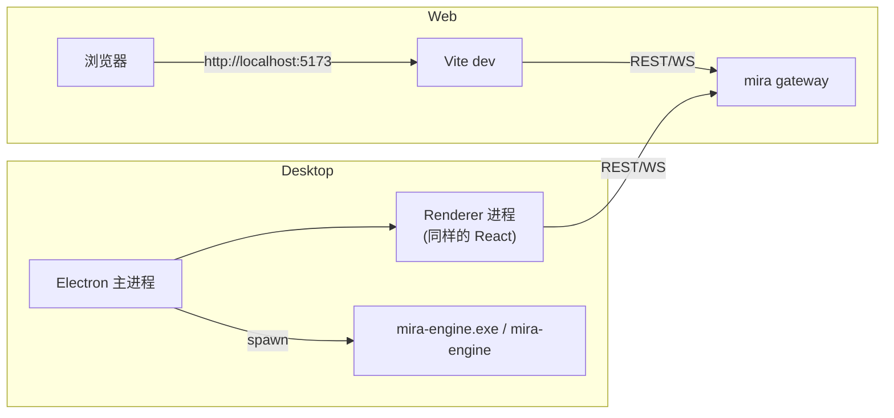

# Web / Desktop 双模式

## 它解决什么

`{{PROJECT_UI_NAME}}` 同一份代码可以跑在两种容器里：

- **Web 模式**：浏览器访问 Vite dev server / 静态构建产物。
- **Desktop 模式**：Electron 包裹的桌面应用，可联调可打包安装。

> 两者共用 React 组件、状态机、API client，只在 “怎么找到 mira gateway” 与 “怎么打开本地文件” 这两件事上有区别。



## 用哪个

| 你的需求 | 选 |
| --- | --- |
| 团队多人共用一份后端 | Web |
| 远程访问（SSH 转发 / 内网） | Web |
| 个人工作站、希望开机即用 | Desktop |
| 离线/无网络环境 | Desktop（配合本地 Ollama） |
| 需要在 “Finder/Explorer 里打开文件” | Desktop |
| 想给非技术同事一个安装包 | Desktop |

## Web 模式

### 开发联调

```bash
cd mira-ui
npm install
npm run dev
# 访问 http://localhost:5173
```

可通过 `.env.local` 指定后端地址：

```bash
VITE_API_URL=http://localhost:18790
VITE_WS_URL=ws://localhost:18790/ws
```

### 静态构建

```bash
npm run build:web
# 产物在 dist/，把它扔到任意静态服务器（nginx / caddy）即可
```

把 nginx 反代加上 `/api` 与 `/ws` 转到 `mira gateway` 端口就完成部署。模板见 [自托管部署](../../deployment/self-hosted)。

## Desktop 模式

### 联调（同时拉起 Electron + Vite）

```bash
npm run dev:electron
```

Electron 主进程会：

1. 起一个内部的 Vite dev server。
2. 打开窗口加载它。
3. 按需 `spawn` 本地的 `mira-engine`（如果你已 `pip install` 或装了 PyInstaller 版的可执行文件）。

### 打包

```bash
npm run build:electron     # 只打包 renderer（不出安装包）
npm run dist               # 出当前平台安装包到 release/
npm run build:desktop      # 等价 build:web + build:electron
```

产物位置：

| 平台 | 文件 |
| --- | --- |
| macOS | `release/MiraUI-<ver>-mac-<arch>.dmg` |
| Windows | `release/MiraUI-<ver>-win-<arch>-setup.exe` |
| Linux | `release/MiraUI-<ver>-linux-<arch>.AppImage` |

### Electron 怎么找 `mira-engine`

启动顺序：

1. 已设置 `MIRA_ENGINE_PATH` 环境变量 → 直接用它。
2. 系统 `PATH` 上能找到 `mira-engine`（或 Windows 的 `mira-engine.exe`） → 用它。
3. 落到打包内置的 PyInstaller 二进制 → 用它（适合无 Python 环境的最终用户）。

> 想强制 Electron 用你 `pip install -e .` 的开发版？`export MIRA_ENGINE_PATH=$(which mira-engine)` 后再 `npm run dev:electron`。

## localStorage / 设置迁移

UI 的本地设置（API 地址、主题、最近项目等）存在浏览器 `localStorage`，key 为 `mira-ui-settings`。

从 MedPilot 升级时，UI 会在第一次启动检测到旧 key `medpilot-ui-settings`，把内容拷贝到新 key 后删除旧的。**对你来说是无感的**。

## 验收检查

- [ ] Web 模式下首页可在 < 2s 加载完成，右上角连接指示绿。
- [ ] Desktop 模式下首次启动若未配置 engine，UI 会弹出提示并指引 `mira onboard`。
- [ ] 打包产物在干净的目标系统上能直接启动并连上后端（或本地 spawn 的 engine）。
- [ ] 切换 Web/Desktop 模式后，项目列表、设置等数据一致（前提是连同一个后端）。
