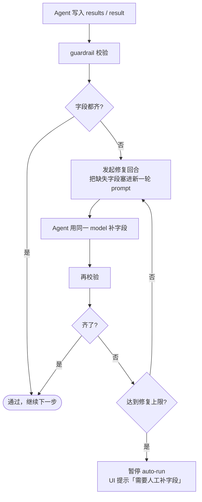

# Guardrail 与自动修复

## 它是干什么的

每次 Agent 写入实验结果或导出最终交付物后，**guardrail** 会按当前 `contract_version` 把字段过一遍：缺哪个补哪个，发现占位文本（`TODO`、`待补充`、`N/A` 等）也算缺失。任何一项不通过都会触发一次专用的 **修复回合**（Agent 自己回头补字段，不打扰你）。

> 它不是“拦截器”，而是“自动补丁机制”。你看到 UI 顶端出现黄色 `Repairing` 时，背后就是它在工作。

## 触发与流转



默认每个实验最多 3 次自动修复回合。3 次仍不齐，会停下让你处理。

## strict 模式下哪些字段会被卡

| 字段 | 期望 | 常见占位（会被识别为“缺失”） |
| --- | --- | --- |
| `theoretical_proof` | 解释方法学上为什么有效 | `"TODO"` / `"待补充"` / 空字符串 |
| `isolation_test` | 至少描述一次变量隔离 | `"N/A"` / `"暂无"` |
| `post_mortem` | 复盘成败原因 | `"无"` / `"-"` |
| `evidence_refs` | 至少 1 个引用 ID 或 URL | `[]` |
| `results.findings` | 真正的文字结论 | 仅含 “请见 metrics” 之类的转引 |
| `results.artifacts[].path` | 真实可访问路径 | 不存在的占位路径 |

<!-- ## UI 上能看到什么
**TODO 截图**：项目顶部黄色 `Repairing` 徽章；侧栏 “修复中” 计数；当前实验卡片下方折叠显示的“缺失字段列表 + 已尝试次数”；guardrail 事件流。 -->

## 何时需要你出手

| 情况 | 处理 |
| --- | --- |
| 自动修复 3 次仍失败 | 直接进 [实验详情](experiment-detail) 手动补；明显的占位文本可以直接编辑 task_plan.json |
| 修复回合反复在两个值之间“反复横跳” | 多半是 prompt 不清晰，临时切到 `manual` 模式给 Agent 一段补充说明，再切回 `auto` |
| 提示字段名你完全没见过 | 检查 `contract_version` 是否被改成了 strict（团队共享 config 时常见） |
| 项目导出阶段一直被 guardrail 挡在 Experiment | 至少有 1 个实验的 strict 字段没补齐，必须先在该实验上补齐才能进入 Result |

## 关闭 / 放宽

不希望被打扰，则可以改用`Compact`模式， 或可在 `~/.mira/config.json` 里：

```json
{ "agents": { "defaults": {
  "contract_version": "v1"     // v1 几乎只校验最基础字段
}}}
```

> 强烈不建议在“给别人交付”的项目上关掉 strict。它的成本只是几次额外回合，价值是确保产出可被审稿。

## 验收检查

- [ ] strict 项目里故意删掉 `theoretical_proof`，下一回合能看到 `guardrail.start` → 自动重写 → `guardrail.end`。
- [ ] 修复达到上限后 UI 会出现“需要人工”的提示，且 `auto` 推进暂停。
- [ ] 切回 `v1` 后，原本被卡的字段不再触发 guardrail。
