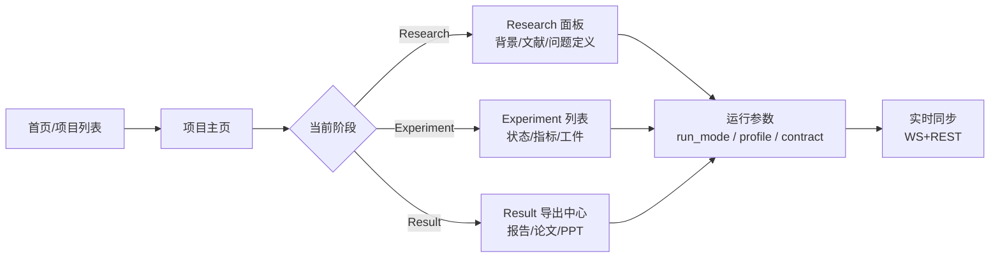

# {{PROJECT_UI_NAME}} 功能导航

`{{PROJECT_UI_NAME}}` 是 `{{PROJECT_CORE_NAME}}` 的可视化前端，覆盖 **创建项目 → 跑实验 → 看证据 → 导出交付物** 的完整闭环。它本身不存数据，所有真相都落在 `~/.mira/workspace/`，UI 只做展示与触发。

*图：UI 主界面布局。*

## 按使用频率排列的入口

### 🔥 日常操作

- [项目队列与元信息管理](./project-queue.md) — 新建 / 切换 / 复制 / 删除项目
- [阶段流水线视图](./pipeline-view.md) — Research / Experiment / Result 三阶段
- [实验详情面板](./experiment-detail.md) — 看指标、证据、工件
- [结果导出中心](./result-center.md) — 触发 `experiment_report` / `paper_article` / `presentation` / `metadata`

### ⚙️ 运行控制

- [运行模式与 Profile](./run-mode-and-profile.md) — `manual`/`auto` × `default`/`engineer`/`research`
- [Guardrail 与自动修复](./guardrail-and-auto-repair.md) — 字段缺失时的自愈机制
- [任务计划与状态同步](./task-plan-and-status.md) — `task_plan.json` 解读
- [实时同步机制](./realtime-sync.md) — WebSocket + REST

### 📦 交付与运维

- [Web / Desktop 双模式](./desktop-web-mode.md) — 浏览器 vs Electron
- [自托管部署](../../deployment/self-hosted.md)
- [打包与发布](../../deployment/release-and-package.md)
- [FAQ 与故障排查](../../faq/troubleshooting.md)

## 一些约定

- **快捷键**：`⌘/Ctrl + K` 打开命令面板（搜项目/实验/动作）；`⌘/Ctrl + Enter` 在编辑框里发送。
- **状态色**：`pending` 灰、`running` 蓝（带动画）、`completed` 绿、`failed` 红、`修复中` 黄。
- **"刷新计划" 按钮**：UI 显示与 `task_plan.json` 不一致时，点它强制重拉一次完整计划。
