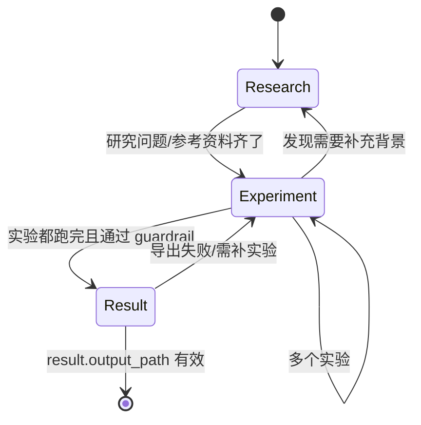

# 阶段流水线视图（Research / Experiment / Result）

## 它在哪 / 长什么样

进入项目后，**顶部的三段式阶段指示条**就是流水线视图。每段对应 `task_plan.json.phase` 的一个值。

**TODO 截图**：顶部三段指示条（当前阶段高亮）、阶段切换按钮、每段下方的概要卡片。

## 三阶段各自做什么

| 阶段 | Agent 主要做的事 | 你应该看的字段 | 结束标志 |
| --- | --- | --- | --- |
| **Research** | 文献检索、问题/假设/方法论梳理 | `research.background` / `research.hypothesis` / `research.references` | 你点 “进入 Experiment” |
| **Experiment** | 跑实验、回写 metrics & artifacts | `experiments[].status` / `results.metrics` / `results.artifacts` | 全部 `completed` 且无 guardrail 待修 |
| **Result** | 触发导出、生成报告/论文/PPT | `result.output_path` / `result.output_type` / `result.summary` | `output_path` 文件存在并合法 |

## 怎么用

### 1) Research

- 在面板里把 `objective` 细化成d多个 **可被实验验证** 的子问题。
- 让 Agent 调 `pubmed-search` / `deep-research` / `multi-search-engine` 拉一轮文献。
- 必要时自己加入 “参考资料” 链接（PDF/URL/笔记），Agent 会在后续阶段引用它们。

### 2) Experiment

- 每条实验对应 `experiments[]` 的一个元素。新建实验时 Agent 会用 `medical-image-dl-pipeline` / `radiomics` / `survival-analysis` 等 skill 落地。
- 阶段流水线条上的小圆点显示每条实验的 `status`，鼠标悬浮可看摘要。
- 遇到 `failed` 实验，**不要急着删**，进 [实验详情面板](./experiment-detail.md) 看 `post_mortem` 与日志，多数能就地修复。

### 3) Result

- 选择导出类型，点 `Export`，Agent 自动调对应 skill：
  - `experiment_report` → `mira_engine/skills/export/experiment-report`
  - `paper_article` → 论文模板
  - `presentation` → PPT 模板
  - `metadata` → 项目归档包（含 `task_plan.json`、`results/*`、参考列表）
- 详见 [结果导出中心](./result-center.md)。

## 切换阶段时会发生什么

- 进 → Research：写入 `phase = research`，UI 把 Experiment / Result 面板置灰。
- Research → Experiment：自动校验 `objective` 与 `hypothesis` 不为空。
- Experiment → Result：触发 guardrail 一次最终校验；如果 strict 字段缺失，**会被挡回 Experiment** 并提示缺哪些字段。

## 验收检查

- [ ] 顶部高亮阶段与 `task_plan.json.phase` 一致。
- [ ] 切阶段后，UI 面板会立即重新渲染并加载该阶段的对应数据。
- [ ] 到 Result 阶段后，可以看到导出类型选择 + 上一次的导出记录（如有）。
