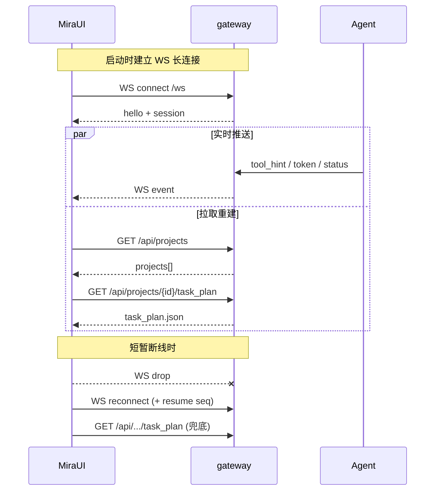
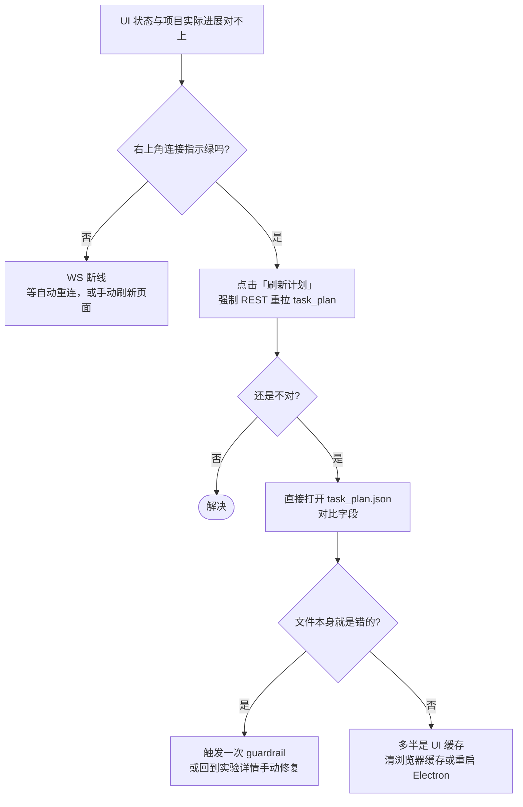

# 实时同步机制（WebSocket + REST）

## 它解决什么

- “我在 UI 看到的 progress 是真的实时吗？”
- “刷新一下 UI 状态会丢吗？”
- “后端断了再连上，UI 怎么恢复？”

## 双通道模型

| 通道 | 用途 | 失败时影响 |
| --- | --- | --- |
| **WebSocket** `/ws` | Agent 文字进度、工具调用提示、阶段切换、guardrail 事件 | 临时看不到“流式”更新，但不丢数据 |
| **REST** `/api/*` | 项目列表、`task_plan.json`、artifact 下载、导出触发 | 列表/详情拉不到，UI 会提示重试 |

> **核心心智**：实时通道负责“好看”，REST 通道才是“真相”。两者不一致时，**永远以 REST 拉到的 task_plan.json 为准**。

## 端点速查

| 方法 | 路径 | 说明 |
| --- | --- | --- |
| `WS` | `/ws` | 主事件流；多种事件类型见下表 |
| `GET` | `/api/projects` | 项目列表 |
| `GET` | `/api/projects/{id}/task_plan` | 完整 task_plan |
| `POST` | `/api/projects/{id}/export` | 触发 Result 导出 |
| `GET` | `/api/projects/{id}/artifacts/{path}` | 下载 artifact |
| `GET` | `/api/health` | 健康检查 |

## 主要 WS 事件类型

| 事件 | 何时发出 | UI 反应 |
| --- | --- | --- |
| `agent.token` | 流式输出每个 token | 拼到当前消息气泡 |
| `agent.tool_hint` | Agent 调用某 tool / skill | 工具调用提示行 |
| `experiment.status` | 实验状态变化 | 卡片状态色刷新 |
| `task_plan.update` | task_plan.json 关键字段写入 | 触发对应面板局部刷新 |
| `guardrail.start/end` | 进入/离开自动修复回合 | 显示黄色 “Repairing” 徽章 |
| `result.exported` | Result 导出完成 | 项目 → Completed |
| `gateway.heartbeat` | 周期心跳（默认 30 分钟） | 维持连接，不展示 |

## “看到不一致” 时的排障

## 验收检查

- [ ] 启动 UI 后右上角显示 “Connected”，`WS` ping 周期 < 30s。
- [ ] 触发一次实验，能看到 token 流式增长。
- [ ] 手动停止 `mira gateway` 再启动，UI 在 5 秒内自动重连且数据不丢。
- [ ] 任何阶段直接访问 `~/.mira/workspace/PRJ-xxxx/task_plan.json`，关键字段与 UI 显示一致。
