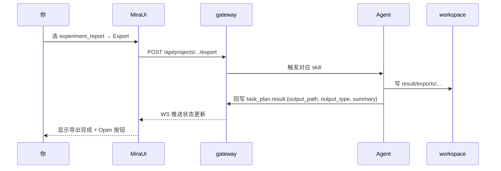

# 结果导出中心（Result 阶段）

## 它在哪 / 长什么样

切到 Result 阶段后看到的中心面板。


## 它做什么

把 Experiment 阶段沉淀的指标、发现、artifacts 打包成 **可分享、可归档** 的最终交付物。落地路径都在项目目录的 `result/exports/` 下。

## 四种导出类型

| 类型 | 输出文件 | 触发的 skill | 适合场景 |
| --- | --- | --- | --- |
| `experiment_report` | `result/exports/experiment_report.md`（含 figures） | `mira_engine/skills/export/experiment-report` | 阶段汇报、组会汇报 |
| `paper_article` | `result/exports/paper_article.md` 或 `.docx` | `mira_engine/skills/export/paper-article` | 期刊投稿初稿 |
| `presentation` | `result/exports/presentation.pptx` | `mira_engine/skills/export/presentation` | 答辩 / 路演 |
| `metadata` | `result/exports/metadata.zip`（task_plan + results + refs） | `mira_engine/skills/export/metadata` | 项目归档、移交 |

## 导出之后会发生什么



完成后 `task_plan.json` 会出现：

```jsonc
{
  "result": {
    "output_path": "result/exports/experiment_report.md",
    "output_type": "experiment_report",
    "summary": "在 77 例 Dixon-MRI 数据上，3D ResNet 优于 2D ..."
  }
}
```

UI 项目卡片上的 `Completed` 徽章是 **以 `result.output_path` 是否合法为准**，不是看实验是否都跑完。

## 常见问题

- **导出按钮灰着按不动**：`task_plan.json.experiments[]` 至少要有一条 `completed` 才允许导出。
- **导出失败**：90% 是 strict 字段缺失。看日志中的 guardrail 提示，回到 [实验详情](experiment-detail) 补齐再导。
- **想换模板**：所有导出 skill 的 Markdown 模板都在 `mira_engine/skills/export/<type>/` 下，可以拷到 `~/.mira/workspace/skills/export/<type>/` 覆盖。

## 验收检查

- [ ] `result/exports/<file>` 物理存在且大小 > 0。
- [ ] `task_plan.json.result` 三个字段都已写入。
- [ ] UI 项目卡片状态在 1-2 秒内变成 `Completed`。
- [ ] 点 `Open` 能在系统默认应用打开（桌面模式）或下载（Web 模式）。
