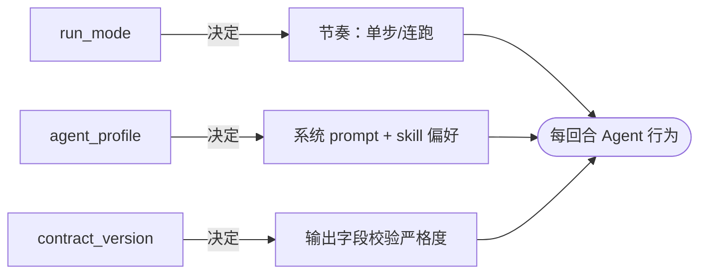

# 运行模式与 Profile
*目前仅支持在 UI 中的使用*

## 三个旋钮

UI 中“项目设置”里有三个并列的下拉/单选，对应 `task_plan.json` 顶层的 `run_mode`、`agent_profile`、`contract_version`。它们正交、互不替代。

| 旋钮 | 取值 | 直觉 |
| --- | --- | --- |
| **`run_mode`** | `manual` / `auto` | 单步等你 vs 自动连跑 |
| **`agent_profile`** | `default` / `engineer` / `research` | 系统 prompt + 默认工具偏好 |
| **`contract_version`** | `v1` / `v2` / `strict` | 输出结构约束等级 |

## 推荐组合

| 场景 | run_mode | profile | contract | 备注 |
| --- | --- | --- | --- | --- |
| 第一次跑 / 摸路 | `manual` | `research` | `v1` | 慢但有掌控感 |
| 临床科研产出 | `auto` | `research` | `strict` | 字段不齐自动修复，最终交付物完整 |
| 工程原型迭代 | `auto` | `engineer` | `v1` | 重吞吐 |
| 复盘单实验 | `manual` | `research` | `strict` | 一步一停看证据 |
| 周期化跑批 | `auto` | `engineer` | `v1` | 可挂 cron |

## 三个旋钮分别影响什么

### `run_mode = manual`

- 每完成一回合（含一次 LLM 调用 + 工具调用），**Agent 停下，等你点继续**。
- 适合“我想看清每步在干嘛”、“怕跑飞预算”。

### `run_mode = auto`

- Agent 连续推进，直到：
  - 实验阶段全部 `completed` 且通过 guardrail；或
  - `maxToolIterations` 上限触发（默认 200）；或
  - 你手动点 “Pause”。

### `agent_profile`

| Profile | 系统 prompt 倾向 | 偏好 skill | 适合 |
| --- | --- | --- | --- |
| `default` | 通用 | 中性 | 一般任务 |
| `engineer` | 强调代码、复用、测试 | `engineering/*`、`tmux/*`、`github/*` | 工程改造、原型 |
| `research` | 强调证据、对照、文献 | `research/*`、`medical-imaging/*`、`ml-statistics/*` | 科研项目 |

### `contract_version`

| 版本 | 强制字段 | 适用 |
| --- | --- | --- |
| `v1` | 基础字段（`status`/`results.metrics`/`findings`） | 探索期 |
| `v2` | + `method`、`artifacts` 必须有路径 | 中期 |
| `strict` | + `theoretical_proof`、`isolation_test`、`post_mortem`、`evidence_refs` | 投稿/汇报级 |

> **strict 不是越早开越好**。一开始就开会让 guardrail 频繁打断 Agent 的探索。建议确认实验路线后再升级到 strict。

## 切换会发生什么

- `run_mode auto → manual`：当前回合结束后停下；不会强制中断已发出的 LLM 请求。
- `agent_profile` 切换：**只影响下一回合**。已经写入 `task_plan.json` 的字段不会被改写。
- `contract_version` 升档（如 v1 → strict）：立即触发一次全量 guardrail 校验；缺字段的实验会被回到 Experiment 阶段补齐。

## 验收检查

- [ ] 三个旋钮的当前值与 `task_plan.json` 顶层字段完全一致。
- [ ] `auto` 切到 `manual` 后下一回合就停。
- [ ] 升 strict 后能在日志里看到一次 `guardrail.start` → `guardrail.end` 事件。
