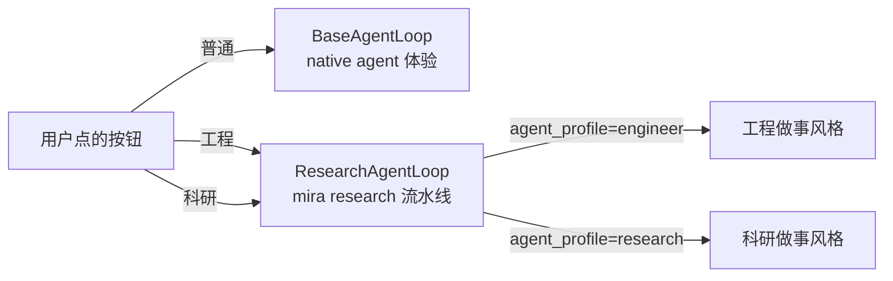

# 运行模式与 Profile
*目前仅支持在 UI 中的使用*

## 三档运行模式：普通 / 工程 / 科研

UI 顶栏最显眼的“普通｜工程｜科研”三段切换，并不是单一字段，而是把两层概念折叠到了一个旋钮里：

| UI 按钮 | 走的路径 | 底层取值 | 直觉 |
| --- | --- | --- | --- |
| **普通** | `BaseAgentLoop`（native agent，**跳过** mira research 流水线） | `app_mode = normal` | 像普通对话/工具型 Agent；不创建项目，不写 `task_plan.json`，不跑 guardrail。 |
| **工程** | `ResearchAgentLoop`（走 mira research 流水线） | `app_mode = project` `agent_profile = engineer` | 走完整研究流水线，但系统 prompt + skill 偏好偏工程：代码、复用、测试、工程脚手架。 |
| **科研** | `ResearchAgentLoop`（走 mira research 流水线） | `app_mode = project` `agent_profile = research` | 走完整研究流水线，系统 prompt + skill 偏好偏科研：证据链、对照实验、文献。 |

关键区别其实只有一层：

- **普通 vs 工程/科研**：是否走 mira research 流水线（task_plan / experiments / guardrail / 自动 result 导出）的**架构性差别**。
- **工程 vs 科研**：流水线相同，只是 **profile（做事风格）** 不同——影响系统 prompt、默认 skill 偏好、对“产出形态”的偏向。

> 普通模式接近你熟悉的“聊天 + 工具调用”体验；工程/科研模式才是 `{{PROJECT_CORE_NAME}}` 为研究/工程项目深度优化的多回合流水线。

## 什么时候选哪个

| 场景 | 选 | 备注 |
| --- | --- | --- |
| 写个脚本/查个文档/做一次性问答 | **普通** | 不需要项目，不需要交付物，单纯找 Agent 帮一把 |
| 工程原型迭代（写代码、调流水线、自动化任务） | **工程** | 偏工程 skill，重吞吐 |
| 周期化跑批 / CI 中触发 | **工程** + `auto` | 工程 profile + 自动连跑 |
| 临床/医学影像/统计科研课题 | **科研** | 偏 research / medical-imaging / ml-statistics skill |
| 投稿/汇报级交付（要全套证据链） | **科研** + `strict` contract | 字段不齐自动修复，最终交付物完整 |
| 第一次跑、摸路 | **科研** + `manual` | 慢但有掌控感 |

## 另外两个旋钮（仅在工程/科研模式下生效）

普通模式跳过 mira research 流水线，因此 `run_mode` 和 `contract_version` 这两个旋钮**只对工程/科研生效**。

| 旋钮 | 取值 | 直觉 |
| --- | --- | --- |
| **`run_mode`** | `manual` / `auto` | 单步等你 vs 自动连跑 |
| **`contract_version`** | `v1` / `v2` / `strict` | 输出结构约束等级 |

### `run_mode = manual`

- 每完成一回合（含一次 LLM 调用 + 工具调用），**Agent 停下，等你点继续**。
- 适合“我想看清每步在干嘛”、“怕跑飞预算”。

### `run_mode = auto`

- Agent 连续推进，直到：
  - 实验阶段全部 `completed` 且通过 guardrail；或
  - `maxToolIterations` 上限触发（默认 200）；或
  - 你手动点 “Pause”。

### `contract_version`

| 版本 | 强制字段 | 适用 |
| --- | --- | --- |
| `v1` | 基础字段（`status`/`results.metrics`/`findings`） | 探索期 |
| `v2` | + `method`、`artifacts` 必须有路径 | 中期 |
| `strict` | + `theoretical_proof`、`isolation_test`、`post_mortem`、`evidence_refs` | 投稿/汇报级 |

> **strict 不是越早开越好**。一开始就开会让 guardrail 频繁打断 Agent 的探索。建议确认实验路线后再升级到 strict。

## 推荐组合

| 场景 | 模式 | run_mode | contract | 备注 |
| --- | --- | --- | --- | --- |
| 摸路 / 第一次跑 | 科研 | `manual` | `v1` | 慢但有掌控感 |
| 临床科研产出 | 科研 | `auto` | `strict` | 字段不齐自动修复，最终交付物完整 |
| 工程原型迭代 | 工程 | `auto` | `v1` | 重吞吐 |
| 复盘单实验 | 科研 | `manual` | `strict` | 一步一停看证据 |
| 周期化跑批 | 工程 | `auto` | `v1` | 可挂 cron |
| 一次性问答 / 工具型任务 | 普通 | — | — | 无 task_plan、无 guardrail |

## 切换会发生什么

- **普通 ↔ 工程/科研**：切到普通时左侧项目栏会折叠，当前选中项目被清空；切回工程/科研时回到上一个选中项目（或新建项目）。普通模式下你发出的消息走的是 `BaseAgentLoop`，**不会**写入 `task_plan.json`。
- **工程 ↔ 科研**：只改 `agent_profile`，**只影响下一回合**。已经写入 `task_plan.json` 的字段不会被改写。
- `run_mode auto → manual`：当前回合结束后停下；不会强制中断已发出的 LLM 请求。
- `contract_version` 升档（如 v1 → strict）：立即触发一次全量 guardrail 校验；缺字段的实验会被回到 Experiment 阶段补齐。

> 工程/科研运行中（`isStreaming` 或某实验 `running`）时，UI 会禁用模式切换按钮——先停下再切，避免半路替换 prompt 让上下文错位。

## 验收检查

- [ ] 在普通模式下发消息后，`~/.mira/workspace/` 不会出现新的 `PRJ-xxxx/` 目录。
- [ ] 在工程/科研模式下发消息后，对应项目的 `task_plan.json` 顶层 `agent_profile` 字段与 UI 选中状态一致。
- [ ] `auto` 切到 `manual` 后下一回合就停。
- [ ] 升 strict 后能在日志里看到一次 `guardrail.start` → `guardrail.end` 事件。

> CLI（`mira research --profile`）仍保留 `default` profile 作为兼容值；UI 不再暴露，新建项目默认即 `engineer` 或 `research`。详见 [CLI 参考](../../cli-reference.md#mira-research)。
