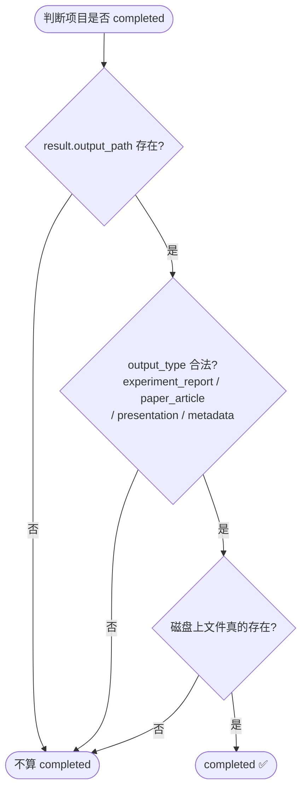

# 任务计划与状态同步

## 这一页解决什么

UI 上显示的状态、阶段、结果摘要，**全部来自 `task_plan.json`**。当 UI 看起来不对劲时，第一动作不是刷页面，是打开这个文件。

> 真相在磁盘。`task_plan.json` 在 `~/.mira/workspace/PRJ-xxxx/task_plan.json`。

## 文件结构（删减版）

```jsonc
{
  "id": "PRJ-0042",
  "title": "Dixon-MRI 呼气/吸气分类",
  "objective": "...",

  "phase": "experiment",                // research / experiment / result
  "status": "running",                  // pending / running / completed / failed
  "run_mode": "auto",
  "agent_profile": "research",
  "contract_version": "strict",

  "current_experiment": "exp-003",

  "research": {
    "background": "...",
    "hypothesis": "...",
    "references": [{ "id": "ref-1", "title": "...", "url": "..." }]
  },

  "experiments": [
    {
      "id": "exp-001",
      "method": "3D ResNet, 5-fold CV, AdamW",
      "status": "completed",
      "results": {
        "metrics": { "auc": 0.91, "acc": 0.87 },
        "findings": "3D 优于 2D，差距随训练量扩大",
        "artifacts": [
          { "path": "experiments/exp-001/best_model.pt", "kind": "model" },
          { "path": "experiments/exp-001/roc.png", "kind": "figure" }
        ]
      },
      "theoretical_proof": "...",
      "isolation_test": "...",
      "post_mortem": "...",
      "evidence_refs": ["ref-1"]
    }
  ],

  "result": {
    "output_path": "result/exports/experiment_report.md",
    "output_type": "experiment_report",
    "summary": "..."
  }
}
```

## 字段 → UI 元素 对照

| `task_plan.json` 字段 | 对应 UI 位置 |
| --- | --- |
| `title` | 项目卡片标题、浏览器标签页 |
| `phase` | 顶部三段流水线高亮 |
| `status` | 项目卡片状态徽章颜色 |
| `current_experiment` | 实验列表里高亮的那一条 |
| `experiments[].status` | 实验卡片状态徽章 |
| `experiments[].results.metrics` | 实验详情里的指标表 |
| `result.output_path` | Result 阶段的 “Open / Download” 按钮 |
| `result.output_type` | Result 阶段卡片标题（“实验报告 / 论文 / PPT / 元数据”） |

## 状态判定规则



**核心结论：实验都跑完 ≠ 项目 completed。** 必须有合法的最终交付物。

## 排障速查

| 现象 | 80% 的原因 | 直接动作 |
| --- | --- | --- |
| “实验都完成了，但项目卡片还是蓝色 Running” | `result.output_path` 还没写 | 进 Result 阶段触发一次导出 |
| “UI 显示与日志不一致” | UI 缓存了旧 task_plan | 点 “刷新计划” 或重启 UI |
| “导出完成但卡片没变绿” | `result.output_path` 指向的文件已被删 | 检查 `~/.mira/workspace/PRJ-xxxx/result/exports/` |
| “current_experiment 指向不存在的 id” | guardrail 还没收尾 | 等 1 个回合，或手动改 task_plan |

## 直接编辑 task_plan.json 安全吗

**安全，但有约束**：

- 必须停掉 `auto` 推进（避免 Agent 同时写）。
- 不要破坏 JSON schema（必填字段不能少；不确定就先备份）。
- 改完触发一次 “刷新计划”，让 UI 与运行时一起重新加载。

## 验收检查

- [ ] 任意时刻，UI 上显示的 `phase`/`status`/`current_experiment` 与 task_plan.json 完全一致。
- [ ] 触发导出后 1-2 秒内，`result.output_path` 写入 + UI 状态变 `Completed`。
- [ ] 手动删除 `result/exports/<file>` 后再点 “刷新计划”，UI 应回退为非 completed。
